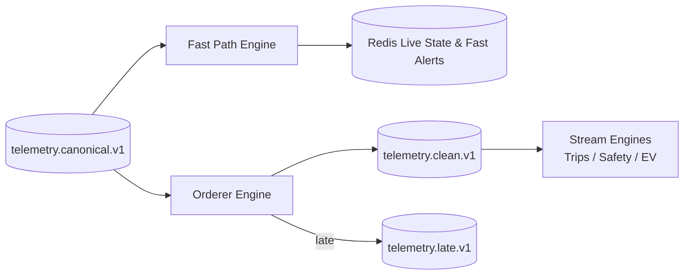

# ADR-003: Two-Path Processing Architecture (Fast Path vs. Ordered Path)

## Status
Accepted

## Context
FleetPulse receives telemetry from 100,000 vehicles at ~100,000 events/second. These events serve two conflicting requirements:
1. **Low-Latency Operational Awareness (< 2s e2e, < 5s alerts):** Live map displays, dispatch dashboards, geofence breaches, range-risk warnings, and tow alerts must be evaluated immediately. Waiting for out-of-order buffers or resequencing adds unacceptable latency.
2. **Deterministic Correctness:** Trip segmentation, idle detection, battery state-of-health estimation, and driver safety scoring require deduplicated, strictly in-order event streams. Network transport delays (up to 8–60s) and multi-path retries produce duplicates and out-of-order deliveries.

## Decision
We split canonical telemetry consumption into two independent paths (§4.1, §4.2):

1. **Fast Path:**
   - Consumes directly from `telemetry.canonical.v1` with zero buffering.
   - Updates Redis live state (`live:{tenant}:{pid}`) using last-write-wins (drops event only if `ts_event < existing.ts`).
   - Evaluates stateless rules (critical DTC, sudden displacement tow alert, emergency range risk) and raises alerts in < 5 seconds.
2. **Ordered Path (Orderer):**
   - Consumes from `telemetry.canonical.v1` and applies rotating Bloom filter + sequence window deduplication (§7.6).
   - Holds events in a per-vehicle priority buffer bounded by `allowed_lateness_s` (10s) and watermark progression (§7.7).
   - Emits clean, deduplicated, sorted events to `telemetry.clean.v1` for downstream analytics engines.

## Consequences
- **Positive:** Live map updates immediately with sub-second latency while complex state machines (trips, safety) operate on pristine, in-order streams.
- **Negative:** Telemetry is processed by two consumer groups, slightly increasing Kafka consumer bandwidth. This is an intentional and worthwhile trade-off.
