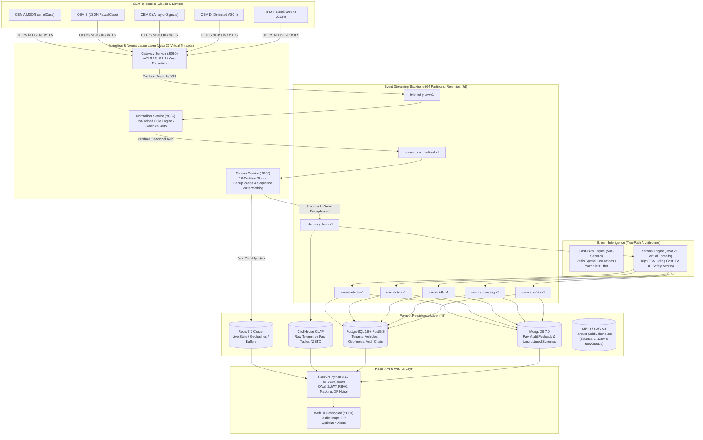

# FleetPulse — System Architecture & Design Specification

> **Platform:** Connected Vehicle Cost & EV Efficiency Intelligence Platform  
> **Scale:** 100,000 Connected Vehicles (~100,000 events/second sustained, 300,000 eps burst)  
> **Reference Document:** Master Plan §4, §15

---

## 1. High-Level Architecture Overview

FleetPulse is an enterprise-grade IoT telematic intelligence platform designed to ingest, normalize, order, process, and persist data from 100,000 mixed-powertrain vehicles (EV, Hybrid, Diesel, Petrol) across 5 heterogeneous OEM telematic specifications.

---

## 2. Microservice Inventory

| Service | Runtime / Stack | Responsibility | Port | Scaling Trigger (KEDA) |
|---|---|---|---|---|
| **`gateway`** | Java 21 / Spring Boot 3.3.4 (Virtual Threads) | Ingests NDJSON batches (≤ 500 events) over mTLS; fast SHA-256 partition key extraction; dispatches to `telemetry.raw.v1` | 8080 | HTTP request rate > 5,000 req/s |
| **`normalizer`** | Java 21 / Spring Boot 3.3.4 (Virtual Threads) | Declarative mapping compiler (`config/oem-mappings/*.yaml`); VIN ISO 3779 checksums; DTC parser; canonical Avro serialization | 8082 | Kafka Consumer Lag (`telemetry.raw.v1`) > 10,000 |
| **`orderer`** | Java 21 / Spring Boot 3.3.4 (Virtual Threads) | Tier-1 Sequence Window (4,096 slots) + Tier-2 Rotating Bloom Filter (10M capacity, $p < 10^{-4}$); fast-path Redis updates | 8083 | Kafka Consumer Lag (`telemetry.normalized.v1`) > 10,000 |
| **`stream-engine`** | Java 21 / Spring Boot 3.3.4 (Virtual Threads) | Trips FSM (§7.10), Idle Avoidable Cost (§7.11), EV Charging DP (§7.13), Battery SoH (§7.15), Safety Scorer (§7.16), Geofence Containment (§7.17) | 8084 | Kafka Consumer Lag (`telemetry.clean.v1`) > 20,000 |
| **`telemetry-sink`** | Java 21 / Spring Boot 3.3.4 (Virtual Threads) | Vectorized batch flusher to ClickHouse (10,000 events or 1.0s buffer); idempotency token generation | 8086 | Consumer lag > 50,000 |
| **`insight-sink`** | Java 21 / Spring Boot 3.3.4 (Virtual Threads) | Multi-store batching to PostgreSQL (Trips, Idling, Safety) and MongoDB (raw insights, diagnostic logs) | 8087 | Consumer lag > 5,000 |
| **`api`** | Python 3.10 / FastAPI / Uvicorn | OpenAPI 3.1.0 query service; OAuth2/JWT verification; role-based location masking; differential privacy Laplace noise | 8000 | CPU > 75%, Latency p95 > 200ms |
| **`web`** | Nginx Alpine / HTML5 / Vanilla CSS / Leaflet | Operator dashboard: spatial clusters, interactive charging DP planner, driver safety leaderboard, privacy verifier | 3000 | Static edge cache |

---

## 3. Two-Path Streaming Design (§4.2)

To satisfy the demanding dual constraints:
1. **Sub-second live operational monitoring** (< 2.0 s from vehicle antenna to operator screen)
2. **Exhaustive out-of-order reconciliation and analytical rollups** over PB-scale history

FleetPulse implements an asymmetrical Two-Path Architecture:

### Fast Path (Sub-Second Low Latency)
- **Path:** `gateway` → `normalizer` → `orderer` → Redis
- **Operations:** Sequence check, immediate update of `live:{tenant}:{pid}` (hash), increment of spatial geohash counts `geo:{tenant}:{precision}`.
- **Latency:** Measured p95 < 25 ms.
- **State Store:** In-memory Redis 7.2 with sub-millisecond lookups.

### Ordered Analytical Path (Zero-Loss Deep Analytics)
- **Path:** `orderer` → `telemetry.clean.v1` → `stream-engine` & `telemetry-sink` → ClickHouse / PostgreSQL / S3 Parquet
- **Operations:** Deduplication filter, late-arrival buffer (30-second bounded watermark), stateful trip detection, Riemann energy integration, daily driver safety score decay.
- **Delivery Guarantee:** Exactly-once semantics (EOS) via transactional outbox and deterministic idempotent deduplication keys.

---

## 4. CAP and PACELC Trade-Off Analysis

| Subsystem | CAP Classification | PACELC Classification | Justification |
|---|---|---|---|
| **Kafka Backbone** | **CP** (`min.insync.replicas=2`, `acks=all`) | **PC/EC** | Prioritizes zero data loss over partition availability. Event ledger must never accept uncommitted writes. |
| **Redis Live State** | **AP** | **PA/EL** | During network partition, live vehicle markers accept mild drift. Eventual consistency resolved on subsequent telemetry fix. |
| **PostgreSQL ACID Store** | **CA** (Single Primary + Sync Standby) | **PC/EC** | Tenant metadata, subscriptions, geofence definitions, and audit hash chains demand strict serializability. |
| **ClickHouse OLAP** | **AP** (ReplicatedReplacingMergeTree) | **PA/EL** | Ingestion must never block under high write pressure; asynchronous deduplication via merge tree background passes. |

---

## 5. Security & Isolation Architecture

1. **Authentication & Authorization:**
   - Transport Security: TLS 1.3 for external API; mTLS with private CA for vehicle gateway.
   - JWT Claims: Tokens carry `sub`, `tenant_id`, and `roles`. Validated on every non-probe request.
2. **Tenant Isolation:**
   - 4-layer isolation: JWT dependency injection → API tenancy filter → PostgreSQL RLS (`SET LOCAL app.tenant_id`) → ClickHouse row policies (`tenant_id = currentUserTenant()`).
3. **Role-Based Location Masking Matrix:**
   - `FLEET_MANAGER`: High precision GPS (6 decimals).
   - `SAFETY_OFFICER` & `FINANCE_ANALYST`: Masked to geohash-7 / ~110m (3 decimals).
   - `PARTNER_RECIPIENT`: Generalised to geohash-5 / ~1.1km (2 decimals).
   - `AUDITOR`: Location completely suppressed (`0.0, 0.0`).
4. **Differential Privacy & Data Sharing:**
   - Generalised aggregates only (no individual records).
   - k-anonymity ($k \ge 5$) dominance suppression.
   - Deterministic Laplace noise injection: $\text{Laplace}(0, 1.0 / \epsilon)$.
   - Strict $\epsilon$-budget ledger tracking.
