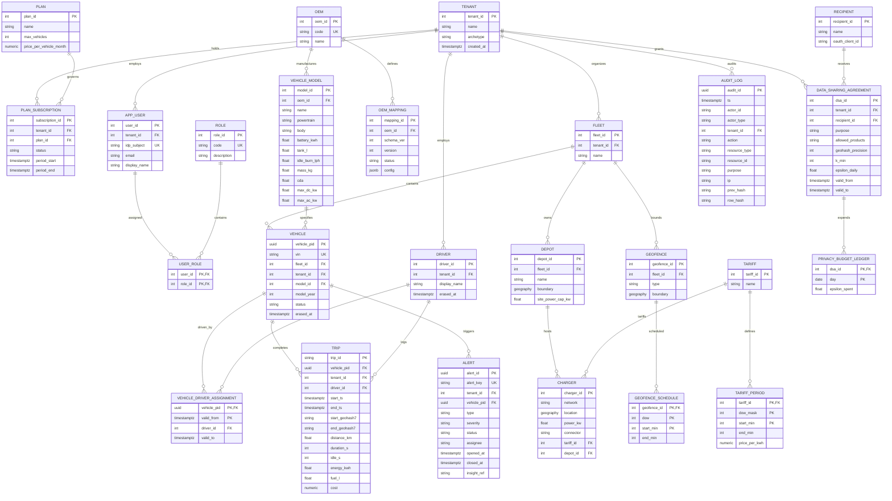

# FleetPulse 3NF Relational Core ER Diagram (§5.3)

This document specifies the PostgreSQL 16 3NF schema, relationships, Row-Level Security (RLS) enforcement boundaries, and deliberate denormalizations.

---

## 1. Entity-Relationship Diagram



---

## 2. Row-Level Security (RLS) Strategy

Tenant isolation is guaranteed by PostgreSQL Row-Level Security policies.
For every tenant-scoped table (`vehicle`, `driver`, `fleet`, `trip`, `alert`, `audit_log`, `data_sharing_agreement`):
1. RLS is forced: `ALTER TABLE <table> ENABLE ROW LEVEL SECURITY;`
2. Isolation policy:
   ```sql
   CREATE POLICY tenant_isolation_policy ON <table>
   AS RESTRICTIVE
   USING (tenant_id = NULLIF(current_setting('app.tenant_id', true), '')::integer);
   ```
3. The API layer applies `SET LOCAL app.tenant_id = :tenant_id` at the start of each transaction based on verified JWT claims. Cross-tenant leakage is physically prevented at the database kernel.

---

## 3. Deliberate Denormalizations (§5.3 Rationale)

1. **`tenant_id` on child tables (`vehicle`, `trip`, `alert`):**
   - *Why:* Enables RLS filtering without requiring expensive cascading joins back to `fleet` or `tenant`.
2. **Aggregated trip totals (`distance_km`, `duration_s`, `cost`, `energy_kwh`):**
   - *Why:* Computing trip aggregates dynamically over millions of raw 1 Hz events would severely degrade query performance. Storing finalized totals on the `trip` record allows sub-50ms operational reporting.
3. **`alert.insight_ref`:**
   - *Why:* Decouples operational alert workflow state (ACID in PostgreSQL) from rich, polymorphic, schema-flexible diagnostic evidence stored in MongoDB.
