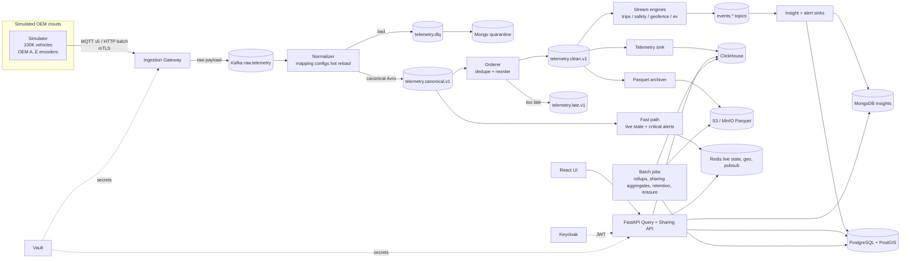

# FleetPulse — Connected Vehicle Cost & EV Efficiency Intelligence Platform

> **Master build plan.** This file is self-contained. An AI agent or a human engineer must be able to build the whole project from this document alone, without the original hackathon problem statement. Everything the statement requires is digested in §1.
>
> **Working title:** FleetPulse (rename freely). **Industry reference:** Motorq (connected-vehicle intelligence). No affiliation with Motorq; it is used only as a domain reference.

---

## 0. How an AI agent must use this document

1. **Build bottom-up, in the order of §15 (Build Phases).** Do not start a phase before the previous phase's acceptance criteria pass. Each phase ends with runnable, tested output.
2. **Contracts are the source of truth.** The canonical Avro schema (§5.1), the OpenAPI spec (§9), the Postgres migrations (§5.3) and the Kafka topic table (§4.3) are written first in Phase 2. Code is generated or validated against them. Never change a contract silently; change the contract file, bump its version, then update code and tests.
3. **Algorithms are pure functions in one library (`fpcore`) with zero I/O.** Write the tests first (unit, property-based, fuzz, golden). Services only wire them to Kafka/stores.
4. **Every feature ships with its tests in the same change.** A feature without tests is not done. See the Definition of Done in §15.17.
5. **Numbers in this plan are defaults, not facts.** Physical constants, prices, thresholds and rates are illustrative and live in one file (`config/defaults.yaml`, §18). Change them there. Never hard-code.
6. **Pin exact dependency versions** in lockfiles (`go.sum`, `poetry.lock`/`uv.lock`, `package-lock.json`, image digests). Use current stable releases at build time; do not guess version numbers from this document.
7. **Every service exposes** `/healthz` (liveness), `/readyz` (readiness), `/metrics` (Prometheus), emits structured JSON logs with a correlation id, reads config from environment variables (12-factor), and handles `SIGTERM` gracefully (drain, commit offsets, flush).
8. **No real personal data, ever.** All data is synthetic. No secrets in the repo (use `.env.example`, Vault, and CI secrets).
9. **When something is ambiguous, pick the simplest option that satisfies the acceptance criteria, record it as an ADR (§4.12), and move on.** Do not add scope.
10. **Report honestly.** If a target cannot be met on the available hardware, measure what is achievable, document the bottleneck, and state the extrapolation method. Never fabricate benchmark numbers.

---

## 1. Source problem digest (what the hackathon demands)

**Theme:** Connected Vehicle Intelligence. Domain: connected vehicles, IoT, big data, enterprise architecture. Format: open-ended build challenge. Judging stresses depth over breadth, and production-quality scale, data engineering, system design, security, testing and DevOps.

### 1.1 Scale assumptions (back-of-envelope given by the problem)

| Parameter | Value |
|---|---|
| Connected vehicles | 100,000 |
| Events per vehicle | 1 per second (location, speed, battery, diagnostics) |
| Ingest rate | ~100,000 events/s; bursts of 3× (shift start, network recovery) |
| Event size | ~1 KB JSON (before compression) |
| Raw volume | ~8.6 TB/day, ~3 PB/year |

A single SQL database fails because of write amplification (many B-tree indexes), connection/lock contention, mixed analytical and transactional workloads, and vertical-scaling limits. Yet fleet ownership, subscriptions, billing, access control and audit logs still need ACID. **Use the right store for each kind of data and justify it.**

### 1.2 Minimum bar (every solution must meet)

- Works on simulated data from **≥ 100,000 vehicles** produced by **our own simulator**.
- **Real-time** processing plus **batch analytics** over history.
- **Relational + NoSQL (+ vector only where useful)**, each justified.
- **Secure APIs** and a usable **web UI**.
- **Containerised, tested, deployable on ≥ 1 cloud** with no code changes for another.

### 1.3 Non-functional targets

| NFR | Target |
|---|---|
| Throughput | Sustain 100,000+ events/s; survive a 3× burst for 5 minutes without data loss |
| Latency | Ingest → dashboard < 2 s; critical alert < 5 s; API p95 < 200 ms, p99 < 500 ms |
| Scalability | Stateless services scale horizontally; adding brokers/nodes needs no code change |
| Availability | No single point of failure; 99.9% target; recovers after a broker or pod is killed |
| Security | OAuth2/OIDC + JWT, RBAC with tenant isolation, mTLS for devices, TLS 1.3 in transit, AES-256 at rest, secrets in a vault, OWASP Top 10 and API Top 10 |
| Compliance | Audit logs for every data access (and AI-agent action, N/A here: no agent); masking of location data; retention and right-to-erasure flow (GDPR, India DPDP) |

### 1.4 Expectations reviewers check (and what this project does)

| Area | Expectation | FleetPulse answer |
|---|---|---|
| IoT ingestion | Bursty, out-of-order, duplicate realistic generator; idempotent, schema-validated, back-pressure-aware intake | Simulator §6; Gateway §4.4 |
| Messaging | Durable, partitioned streams with replay | Kafka, 64 partitions, 7-day retention |
| Big-data pipeline | Real-time detection in seconds + batch over billions of rows | Go stream workers + ClickHouse + Parquet on S3 |
| Persistence | Polyglot with a reason per store | PostgreSQL, ClickHouse, Redis, MongoDB, S3 (§5) |
| Full stack | Secure, paginated, rate-limited APIs, clear UI | FastAPI + React (§9, §11) |
| ML / vector layer | A decision-producing model evaluated against a baseline | **Deliberately no ML.** Deterministic statistical algorithms (EWMA, decay-weighted scoring, DP optimisation, graph search), each evaluated against simulator **ground truth** with precision/recall (§13.4). Vector store is skipped on purpose (ADR-002) |
| Agentic AI | Agent with guardrails and audit | Out of scope (ADR-008) |
| Log analytics | Central logs/metrics/traces | OpenTelemetry + Prometheus + Grafana + Loki |
| DevOps | Microservices, IaC, CI/CD, cloud-agnostic | Docker, Helm, Terraform (AWS module), GitHub Actions |
| Data engineering | 3NF core, partitioning, data generation, SQL optimisation with EXPLAIN ANALYZE before/after | §5, §6, §12.3 |
| Algorithms | Graph, DP, regex/parsing, streaming | §7 (all four families used naturally) |
| System design | CAP/PACELC, idempotency, exactly-once vs at-least-once, back-pressure, circuit breakers, CQRS/event sourcing, cache invalidation, hot/warm/cold lifecycle with cost estimate | §4 |

### 1.5 Testing expectations (heavily weighted; all run in CI on every push)

Unit ≥ 80% coverage on core services and algorithms; integration + contract tests (real broker, DBs, cache via Testcontainers; Pact-style contracts); BDD acceptance scenarios; performance/load at 100K events/s (throughput, p95/p99, consumer lag) plus one soak test; security (SAST, DAST, dependency and image scans); compliance and chaos (audit trail, erasure, kill a pod/broker and prove recovery).

### 1.6 Deliverables checklist (from the statement)

Solution Document (template provided by organisers; map our sections into it) · Git repo with README, **one-command local setup (docker compose)** and a **seeded 100K-vehicle dataset** · Architecture diagram, **3NF ER diagram**, **3–5 ADRs** · Working end-to-end demo on the simulated stream · Test evidence (coverage report, load-test results, security scan reports, CI pipeline link) · DevOps pack (Dockerfiles, Helm/K8s manifests, Terraform for ≥ 1 cloud, **STRIDE threat model**) · Algorithms and SQL write-up with complexity analysis and before/after query plans · **Demo video ≤ 5 minutes**.

### 1.7 Rules

Synthetic or public data only. Open-source and AI tools are allowed but **must be declared** in the Solution Document. Code freeze: only commits before the deadline count; **tag the final commit `v1.0-submission`**. Work must be the team's own. Motorq is only a reference.

---

## 2. Product definition

### 2.1 One-line pitch

> **FleetPulse tells a mixed petrol/diesel/hybrid/EV fleet operator where the fleet is losing money (idling, under-utilisation, expensive charging, risky driving, unapproved asset movement), how much it costs, and what to change, in seconds, from a 100,000-vehicle live stream.**

### 2.2 Core question answered (problem framing)

*"Where are we losing money, how much can we save, and which vehicles, drivers or depots should we act on right now?"* This maps to the statement's problem spaces: **fuel/idling/utilisation cost** and **EV charging and battery health** (main), **driver safety scoring**, **asset recovery** and **privacy-safe data sharing** (side), plus **multi-OEM normalisation** as the platform foundation.

### 2.3 Personas

| Persona | Needs |
|---|---|
| Fleet Operations / Finance Manager | Live fleet view, cost per km, idling cost, utilisation, savings opportunities |
| EV Energy Manager | SoC overview, range-risk alerts, nearest reachable charger, cheapest charging schedule, battery health |
| Safety Officer | Driver scores, risky-pattern explanations, coaching suggestions |
| Asset / Risk Manager (lender-style) | Geofences, after-hours/tow alerts, unapproved-depot discovery, watchlist tracking |
| Partner (OEM/insurer/regulator) | Privacy-safe aggregated insights under a data-sharing agreement |
| Platform Admin / SRE | Pipeline health, simulator control, OEM onboarding without downtime |
| Privacy Officer / Auditor | Audit trail, erasure requests, access reviews |

### 2.4 Feature map

**Foundation (mandatory platform, built first):**

| ID | Foundation component |
|---|---|
| F1 | Synthetic world and real-time **simulator** (100K vehicles) + backfill generator |
| F2 | **Ingestion gateway** (mTLS, schema precheck, back-pressure, idempotent publish) |
| F3 | **Multi-OEM normalisation** with hot-reloadable mappings (onboard a new OEM with zero downtime) and DLQ |
| F4 | **Dedupe + reorder** stage (Bloom + sequence window + watermark) |
| F5 | **Polyglot storage** with hot/warm/cold lifecycle |
| F6 | **Secure API** (OIDC/JWT, RBAC, tenant isolation, keyset pagination, rate limits) |
| F7 | **Web UI** including a simulator/pipeline control panel |
| F8 | **Observability** (metrics, logs, traces, SLO dashboards) |
| F9 | **DevOps** (Docker, compose, Helm, Terraform, CI/CD, scans) |
| F10 | **Security core** (audit hash chain, location masking, tenant isolation, Vault) |

**Main feature modules (depth goes here):**

| ID | Module | Output |
|---|---|---|
| M1 | Live fleet state and map | Last-known state of 100K vehicles, geohash cluster map, live alerts |
| M2 | Trip and stop segmentation | Clean trips/stops from noisy signals (FSM + DP) |
| M3 | Idling and utilisation cost engine | Idle episodes, cost, CO₂, avoidable cost, utilisation |
| M4 | EV intelligence | Charging sessions, battery SoH estimate, range-risk alerts, nearest reachable charger (graph), cost-optimal charging schedule (DP) |
| M5 | Cost analytics (batch + real-time) | Cost per km, leaderboards, top-K idlers, savings opportunities |

**Side features (keep shallow but correct):**

| ID | Feature | Output |
|---|---|---|
| S1 | Driver safety scoring | Explainable 0–100 score, per-event contributions, coaching hints |
| S2 | Asset anomaly and geofence | Geofence breaches, after-hours and tow detection, unapproved-depot clusters, watchlist tracking |
| S3 | Privacy-safe data sharing | Aggregates with pseudonymisation, geohash generalisation, k-anonymity, deterministic differential-privacy noise, budget ledger, consent/purpose limits, right-to-erasure flow |

**Non-goals (explicit):** machine learning/model training, agentic AI, real OEM integrations, real maps/routing services, billing payments (billing is modelled only as ACID data: plans, subscriptions, usage), mobile apps.

---

## 3. Technology stack (decisions with reasons)

Use exactly this stack unless a swap is recorded as an ADR. Keep the language count low: **Go** for the hot path, **Python** for the API and batch, **TypeScript/React** for the UI.

| Layer | Choice | Why | Acceptable swap |
|---|---|---|---|
| Simulator, gateway, normalizer, orderer, stream engine, sinks | **Go** (current stable) | Goroutines, low GC pressure, easy sharding, fast JSON/Avro encode, single static binary | Java + Kafka Streams/Flink (contracts unchanged) |
| Query/Sharing API, batch jobs | **Python 3.12 + FastAPI + SQLModel/SQLAlchemy, Pydantic v2** | Fast to build, strong typing, OpenAPI for free | Spring Boot |
| Web | **React + TypeScript + Vite**, TanStack Query, MapLibre GL + deck.gl (no external tile dependency; draw the synthetic road graph), Recharts/ECharts | Handles 100K-point aggregates with server-side clustering | Any SPA |
| Device/OEM transport | **MQTT v5 via EMQX** (shared subscriptions) + **HTTP/2 batch endpoint** (NDJSON) on the gateway | MQTT is the IoT standard; HTTP batch lets k6 generate 100K events/s | Mosquitto (single node) |
| Stream log | **Apache Kafka (KRaft, 3 brokers)** | Durable, partitioned, replayable; broker-kill chaos demo | Redpanda (Kafka API) |
| Schemas | **Avro + Schema Registry** (BACKWARD compatibility enforced in CI) | Compact, evolvable contracts | Protobuf + Buf |
| Relational core | **PostgreSQL 16 + PostGIS** (RLS for tenant isolation) | ACID for tenants, subscriptions, billing, RBAC, geofences, alerts, operational trips, audit | — |
| Telemetry + analytics | **ClickHouse** (ReplacingMergeTree, TTL to S3 volume) | Columnar, massive batched ingest, cheap scans over billions of rows | TimescaleDB (lower scale ceiling) |
| Live state + caches + dedupe + rate limits + pub/sub | **Redis** (Redis Stack for Bloom if desired; GEO; Streams) | Sub-ms reads, per-vehicle state, geo viewport queries | Valkey/KeyDB |
| Polymorphic insight docs + quarantine | **MongoDB** | Schema-flexible evidence documents per insight type; TTL indexes; DLQ payload store | Cassandra/Couchbase |
| Object store / cold tier | **S3 API (MinIO locally, S3/GCS/Azure Blob in cloud)**, **Parquet (zstd)** | Cheap cold archive, replay, batch | Iceberg tables on top |
| Batch analytics | **ClickHouse SQL over tables and `s3()` Parquet; Python + DuckDB for jobs** | Light, fast; Spark documented as the scale-up path | PySpark |
| AuthN/Z | **Keycloak** (OIDC, PKCE for web, client-credentials for partners) | Standards-based JWT with `tenant_id` and roles | Any OIDC IdP |
| Secrets | **HashiCorp Vault** (dev mode in compose, external-secrets in K8s) | Required by NFRs | Cloud KMS/Secrets Manager |
| Edge/TLS | **Traefik** (TLS 1.3 min, rate-limit middleware) | Compose and K8s ingress | Envoy/nginx |
| Observability | **OpenTelemetry + Prometheus + Grafana + Loki** (+ Tempo optional) | Lighter than ELK, covers metrics/logs/traces | ELK/Splunk |
| Containers/orchestration | **Docker, docker compose, Kubernetes + Helm**; operators: Strimzi (Kafka), CloudNativePG (Postgres), Altinity (ClickHouse) | Cloud-agnostic | Managed services behind same interfaces |
| IaC | **Terraform** (AWS module: VPC, EKS, S3, IAM; GCP/Azure module stub) | Required deliverable | Pulumi |
| CI/CD | **GitHub Actions** | Required automation | GitLab CI |
| Test tools | `go test` + `rapid`/fuzz, Testcontainers (Go and Python), pytest + Hypothesis, behave (BDD), Pact (HTTP contracts) + schema-registry compatibility (Kafka contracts), Playwright (E2E UI), k6 (HTTP load) | Covers every required test type | Locust, Gatling, Cucumber |
| Security scans | Semgrep (SAST), OWASP ZAP baseline (DAST), Trivy (deps/images/IaC), gitleaks, govulncheck, pip-audit, npm audit, hadolint, checkov | Required | SonarQube |

**Explicitly not used:** vector database (no embedding use-case; forcing one would be fake depth; ADR-002), Flink/Spark (custom Go workers give full algorithm control; state is tiny; ADR-006), any ML framework.

---

## 4. Architecture and system design

### 4.1 Logical architecture



### 4.2 End-to-end data flow (one event)

1. Simulator emits an OEM-specific payload for vehicle V (A..E format) with realistic imperfections (§6.6).
2. **Gateway** authenticates the OEM-cloud client (mTLS), does a cheap syntactic precheck (size, UTF-8/JSON parse-ability or frame validity), applies back-pressure if downstream is saturated, and publishes the **raw bytes** to `raw.telemetry` with headers (`oem`, `recv_ts`, `traceparent`). Partition key = raw device/VIN string.
3. **Normalizer** selects the OEM mapping (by `oem` header + schema version), converts to the **canonical Avro event** (units, time, enums), validates VIN (§7.1) and DTC (§7.2), resolves `vin → vehicle_pid` and `tenant_id` from a Redis-cached view of Postgres, and publishes to `telemetry.canonical.v1` keyed by `vehicle_pid`. Anything invalid goes to `telemetry.dlq` with a reason code.
4. **Two consumers of canonical**:
   - **Fast path** (latency-critical, no waiting): updates Redis live state (last-write-wins by event time, stale events ignored), geo cell counters, and evaluates **stateless critical rules** (range risk, restricted-geofence breach, tow suspicion, critical DTC) to raise alerts in < 5 s.
   - **Orderer** (correctness path): dedupes (§7.6) and reorders within an allowed lateness (§7.7), publishing `telemetry.clean.v1` (ordered, unique) and `telemetry.late.v1`.
5. **Stream engines** consume `clean` (trips, idling, safety, geofence sustained rules, EV sessions) and emit domain events.
6. **Sinks** write to ClickHouse (telemetry + facts), Parquet (archive), Postgres (trips, alerts), Mongo (insights).
7. **API** serves queries; **UI** shows the live map via SSE/polling and dashboards.

### 4.3 Kafka topics

All topics: replication factor 3, `min.insync.replicas=2`, producers `acks=all` + idempotent, `unclean.leader.election.enable=false`, compression `zstd`/`lz4`.

| Topic | Key | Partitions | Retention | Value |
|---|---|---|---|---|
| `raw.telemetry` | raw device id | 64 | 24 h | raw OEM bytes + headers |
| `telemetry.canonical.v1` | `vehicle_pid` | 64 | 3 d | Avro canonical event |
| `telemetry.clean.v1` | `vehicle_pid` | 64 | 7 d | Avro, ordered + unique |
| `telemetry.late.v1` | `vehicle_pid` | 16 | 7 d | Avro, late events |
| `telemetry.dlq` | raw device id | 16 | 14 d | raw bytes + error code |
| `events.trip.v1`, `events.idle.v1`, `events.safety.v1`, `events.charging.v1`, `events.geofence.v1` | `vehicle_pid` | 16 each | 14 d | Avro domain events with deterministic ids |
| `alerts.v1` | `vehicle_pid` | 16 | 14 d | Avro alert (idempotency key inside) |
| `config.oem-mappings` | `oem:version` | 1 (compacted) | infinite | mapping configs (hot reload) |
| `commands.erasure.v1` | `subject_id` | 4 | 30 d | erasure commands to each store worker |
| `audit.v1` | `tenant_id` | 8 | 30 d | audit events → Postgres hash chain |

**Partitioning rule:** always key by `vehicle_pid` so one vehicle is processed by one worker in order (avoids cross-worker state). 64 partitions allow up to 64 parallel consumers per group. Hot-spot check: a tenant with many vehicles still spreads across partitions because the key is the vehicle, not the tenant.

### 4.4 Service inventory (microservices and boundaries)

| Service | Language | Stateful? | Responsibility |
|---|---|---|---|
| `simulator` | Go | in-memory world | World + vehicle simulation, OEM encoders, imperfections, ground-truth ledger, control API |
| `gateway` | Go | no | mTLS, auth, precheck, back-pressure, batching producer; MQTT subscriber (shared subscription) + `POST /v1/ingest/batch` |
| `normalizer` | Go | no (caches) | Mapping engine, canonical conversion, VIN/DTC validation, DLQ, hot-reload |
| `orderer` | Go | per-partition state | Dedupe, reorder, late routing |
| `stream-engine` | Go | per-vehicle state | One binary, `--processor=fast\|trips\|safety\|geofence\|ev`; deployed as separate Deployments |
| `telemetry-sink` | Go | no | Batched ClickHouse inserts with dedup tokens |
| `archiver` | Go | no | Kafka → hourly Parquet files on S3 |
| `insight-sink` | Go | no | Idempotent writes to Postgres (trips, alerts) and Mongo (insights), ClickHouse facts, Redis streams for SSE |
| `api` | Python | no | REST + SSE, RBAC, sharing API, admin |
| `batch` | Python | no | Rollups, sharing aggregates, retention/downsampling, erasure executor, nightly reports |
| `web` | TypeScript | no | SPA |

### 4.5 Delivery semantics and idempotency (ADR-004)

- **At-least-once everywhere, idempotent effects everywhere = effectively-once.** Offsets are committed only **after** the downstream write (or checkpoint) succeeds.
- **Deterministic ids:** `event_id = hash(vehicle_pid, ts_event_ms, seq|content)`, `trip_id = hash(vehicle_pid, start_ts)`, `alert_key = hash(vehicle_pid, type, window_start)`.
- **ClickHouse:** batches are built from contiguous Kafka offset ranges; the insert uses `insert_deduplication_token = topic-partition-firstOffset-lastOffset`, so a retried identical batch is ignored. Table engine is ReplacingMergeTree keyed by event id as a second line of defence.
- **Postgres:** `INSERT ... ON CONFLICT (id) DO NOTHING/UPDATE`.
- **Redis state checkpoints:** written in the same loop iteration before committing offsets; on rebalance a worker loads per-vehicle state lazily from Redis.
- **Why not Kafka exactly-once transactions end-to-end:** they do not cover ClickHouse/Postgres/Redis sinks; idempotent sinks are simpler and covered by the zero-loss accounting test (§13.6).

### 4.6 Back-pressure and overload handling

- Gateway has **bounded queues** per producer connection. When queue depth or Kafka producer `buffer.memory` passes a high-water mark: HTTP returns **429 + `Retry-After`**; MQTT applies flow control (receive maximum) and stops acking.
- Consumers pull with bounded batches; slow sinks do not crash upstream because Kafka absorbs the burst (lag increases, then drains). Lag alarms at thresholds (§12).
- **Load shedding order (graceful degradation):** (1) shed simulator "parked heartbeats" first, (2) skip the non-critical analytics sinks (they catch up later from Kafka), (3) never drop critical alerts or live state. The API returns cached data with `X-Data-Age` when stores are slow.

### 4.7 Circuit breakers and retries

- Breakers (closed/open/half-open, e.g. `sony/gobreaker` in Go, `pybreaker` in Python) around Postgres, ClickHouse, Redis, Mongo and S3 calls. Retries use exponential backoff with jitter and a cap. Poison messages (repeated failure) go to DLQ after N attempts.
- When Redis is down: fast path falls back to in-process state and marks live data degraded; the API serves last known values from ClickHouse `argMax` queries (slower but correct).

### 4.8 CQRS and event sourcing

- **Write side:** events in Kafka are the system of record for telemetry and domain events (`events.*`). Nothing mutates history.
- **Read side:** projections are rebuilt from Kafka/Parquet: Redis live state, ClickHouse fact tables, Postgres trip/alert tables, Mongo insights. **Replay** (reset consumer group offsets or read Parquet) rebuilds any projection; used for bug fixes and new mappings.
- **Transactional side (billing, RBAC, config)** uses classic CRUD in Postgres.

### 4.9 Cache design and invalidation

| Cache | Where | Strategy |
|---|---|---|
| `vin → vehicle_pid, tenant_id, model specs` | Redis + in-process LRU (normalizer) | TTL 10 min + **versioned invalidation**: changes to vehicle master publish `cache.invalidate` (Redis pub/sub); workers drop affected keys |
| Fleet summary / cost summary API responses | Redis | Key includes a per-tenant version counter (`ver:{tenant}:cost`) that batch/stream jobs `INCR` on update; stale keys simply expire. Short TTL (15–60 s) |
| OEM mappings | In-memory, fed by compacted Kafka topic | Hot reload: swap atomically after validating against golden samples |
| Geofences | In-memory per engine | Reload on `geofence.changed` notification |

### 4.10 CAP / PACELC decision per data class (ADR-001/002)

| Data | Store | CAP choice | PACELC | Reasoning |
|---|---|---|---|---|
| Billing, subscriptions, RBAC, tenants, audit | PostgreSQL (primary + sync replica) | **CP** | PC/EC | Wrong money or access is unacceptable; accept brief unavailability during failover |
| Raw/clean telemetry in flight | Kafka (`acks=all`, ISR 2) | **CP for writes** | PC/EC (latency cost accepted) | No loss; unclean election disabled |
| Telemetry analytics | ClickHouse replicated | **AP** | PA/EL | Eventual consistency between replicas is fine for analytics; favour ingest availability and low latency |
| Live vehicle state | Redis | **AP / best effort** | PA/EL | A 1–2 s stale location is acceptable; rebuilt from Kafka |
| Insight documents | MongoDB (`w:majority` for alert-related writes, secondary reads for feeds) | Tunable | PC/EL | Alerts need durability; feeds tolerate staleness |
| Cold archive | S3 | **AP**, strong read-after-write | PA/EC | Immutable objects |

### 4.11 Data lifecycle (hot / warm / cold) with cost estimate (assumptions, verify with real pricing)

| Tier | Data | Resolution | Retention | Medium |
|---|---|---|---|---|
| Hot | Raw telemetry in ClickHouse | full rate (≤ 1 Hz) | 7 days | local SSD volume |
| Warm | Downsampled telemetry (`telemetry_10s` materialised view) | 10 s | 90 days | cheaper disk volume (ClickHouse storage policy) |
| Cold | Parquet (zstd) on S3 | 1 min + all facts/events | ≥ 1 year | object storage |
| Transactional | Postgres core | — | per policy; `trip` partitioned monthly, 60 days hot, older archived | SSD |

**Cost model (write the real numbers into the Solution Document using the formulas):** worst case 100,000 events/s × 86,400 = 8.64 B rows/day. Assume ~40 bytes/row compressed in ClickHouse (Int32 micro-degree coordinates, Delta+ZSTD codecs; **measure this** with `system.parts` after a run) ⇒ ≈ 345 GB/day ⇒ hot 7 d ≈ 2.4 TB. Warm: 864 M rows/day × 40 B ≈ 35 GB/day × 90 ≈ 3.1 TB. Cold: 144 M rows/day × 40 B ≈ 5.8 GB/day ≈ 2.1 TB/year. Multiply by current provider storage prices and replication factor. Average real fleets are below the 1 Hz-for-all worst case (parked vehicles report rarely); state both numbers.

### 4.12 Architecture Decision Records to write (3–5 required; write these 8 short ones)

| ADR | Decision |
|---|---|
| ADR-001 | Kafka as durable system-of-record log; partition by `vehicle_pid`; CP settings |
| ADR-002 | Polyglot persistence (Postgres/ClickHouse/Redis/MongoDB/S3); **no vector store** and why |
| ADR-003 | Two-path processing: fast path for latency-critical, ordered path for correctness |
| ADR-004 | At-least-once + idempotent sinks (effectively-once) instead of end-to-end transactions |
| ADR-005 | Pseudonymous telemetry keys (`vehicle_pid`); erasure by unlinking + physical deletion job |
| ADR-006 | Custom Go stream workers instead of Flink/Kafka Streams (tiny per-vehicle state, full algorithm control); Flink as scale-out alternative |
| ADR-007 | Hot-reloadable OEM mappings as data (config-as-data, golden-tested) |
| ADR-008 | No ML and no agentic AI in v1; deterministic algorithms evaluated against simulator ground truth |

### 4.13 Reference sizing (targets to validate with the load test, not claims)

For 100K events/s: gateway 4–6 pods, normalizer 8, orderer 8 (one per ~8 partitions), each stream-engine processor 4–8, telemetry-sink 6, Kafka 3 brokers minimum (6 recommended on cloud), ClickHouse 2 shards × 2 replicas, Redis 1 primary + 1 replica (cluster if memory demands), Postgres 1 primary + 1 sync replica. Expected budget for throughput is per-core events/s after profiling; record the measured value and compute the pod count from it.

---

## 5. Data design

### 5.1 Canonical telemetry event (Avro `TelemetryEvent` v1)

| Field | Type | Notes |
|---|---|---|
| `event_id` | string | deterministic id (§4.5) |
| `vehicle_pid` | string (UUID) | pseudonymous key; **no VIN in telemetry** |
| `tenant_id` | int | resolved by normalizer |
| `oem` | string | `A`..`E` |
| `schema_ver` | int | source schema version |
| `ts_event` | long (timestamp-millis) | device time, normalised to UTC |
| `ts_ingest` | long (timestamp-millis) | gateway receive time |
| `seq` | long, nullable | per-vehicle sequence if OEM provides |
| `lat_e6`, `lon_e6` | int, nullable | micro-degrees (≈ 0.11 m resolution) |
| `heading_deg` | int, nullable | 0–359 |
| `speed_kmh` | float, nullable | normalised unit |
| `odo_km` | double, nullable | |
| `ignition` | boolean, nullable | |
| `fuel_pct` | float, nullable | ICE/hybrid, 0–100 |
| `soc_pct` | float, nullable | EV/hybrid, 0–100 |
| `batt_voltage_v` | float, nullable | |
| `charge_state` | enum `NONE, PLUGGED, CHARGING, COMPLETE`, nullable | |
| `charge_kw` | float, nullable | grid-side power; negative never |
| `coolant_c` | float, nullable | |
| `rpm` | int, nullable | |
| `dtc` | array<string> | validated codes |
| `evt` | enum nullable `HARSH_BRAKE, HARSH_ACCEL, HARSH_CORNER, OVERSPEED, COLLISION_SUSPECT` | OEM-reported; engines recompute too |
| `quality` | int bitmask | `1 GPS_SUSPECT, 2 LATE, 4 IMPUTED, 8 VIN_WARN, 16 CLOCK_SKEW` |

Compatibility mode: BACKWARD (new fields must have defaults). CI fails on incompatible change.

### 5.2 Raw OEM formats (five deliberately different, used by the simulator and normalizer)

| OEM | Style | Distinguishing traits | Sample |
|---|---|---|---|
| **A "Astra"** | JSON camelCase | km/h, ISO-8601 time, nested `position`, `dtcList` array, `msgSeq` | `{"vehicleId":"<VIN>","timestamp":"2026-09-25T10:15:02.120Z","position":{"latitude":13.0827,"longitude":80.2707,"headingDeg":92},"speedKph":64.2,"odometerKm":18234.7,"ignition":"ON","fuelLevelPct":61.5,"dtcList":["P0301"],"event":"HARSH_BRAKE","msgSeq":88412}` |
| **B "Borealis"** | JSON snake_case, imperial | mph, miles, epoch seconds (float), fuel fraction 0–1, DTCs as `;`-joined string, short event codes (`HB`,`HA`,`HC`,`OS`) | `{"vin":"<VIN>","ts_epoch":1758795302.12,"gps":{"lat":13.0827,"lng":80.2707,"hdg":92},"speed_mph":39.9,"odo_mi":11330.4,"ign":1,"fuel_frac":0.615,"trouble_codes":"P0301;P0420","evt_code":"HB","counter":88412}` |
| **C "Cetus"** | JSON signal list (EV) | epoch ms, odometer in **metres**, SoC as fraction, list of `{n,v}` signals, flags array | `{"deviceId":"<VIN>","tsMs":1758795302120,"signals":[{"n":"SPD","v":64.2},{"n":"SOC","v":0.41},{"n":"ODO","v":18234700},{"n":"LAT","v":13.0827},{"n":"LON","v":80.2707},{"n":"CHG_KW","v":0}],"flags":["HB"]}` |
| **D "Draco"** | Pipe-delimited positional string over MQTT | scaled integers (lat/lon ×1e5, speed ×0.1 km/h, odo ×0.1 km, fuel ×0.1 %), no sequence number (content-hash dedupe needed) | `D1\|<VIN>\|1758795302120\|1308270\|8027070\|642\|182347\|1\|615\|P0301` |
| **E "Echo"** | JSON with **schema drift** (OTA) | **v1:** `{"v":1,"vin":..,"t":"ISO","lat":..,"lon":..,"spd":km/h,"soc":0-100}`; **v2:** `{"v":2,"vin":..,"t":"ISO","loc":[lon,lat],"spd_ms":17.8,"batt":{"soc":0.41,"volt":372.4,"kw":-12.3}}` (m/s, SoC as fraction, **negative kW = charging**) | both versions must be handled at once |

**Mapping DSL (stored in Postgres `oem_mapping.config` JSONB and published to `config.oem-mappings`):** per canonical field: `source` (JSONPath, positional index or signal name), `transform` (scale, offset, unit conversion, enum map, time parser), `default`, `required`. The normalizer compiles a mapping into a fast closure. New OEM or new schema version = insert a new mapping version, run it against its golden samples, **activate**; no redeploy. Support **shadow mode** (normalise in parallel and compare to the active mapping) before activation.

### 5.3 PostgreSQL relational core (3NF, PostGIS)

Design rules: surrogate keys, FKs everywhere, `tenant_id` denormalised onto tenant-scoped child tables **deliberately** (documented) to enable Row-Level Security without joins. Enums as lookup tables or PG enums. All timestamps `timestamptz` UTC.

| Table | Key columns | Notes |
|---|---|---|
| `tenant` | `tenant_id` PK, `name`, `archetype`, `created_at` | |
| `plan` | `plan_id` PK, `name`, `max_vehicles`, `price_per_vehicle_month` | billing reference |
| `subscription` | `subscription_id` PK, `tenant_id` FK, `plan_id` FK, `status`, `period_start`, `period_end` | CP data |
| `usage_daily` | PK(`tenant_id`,`day`), `active_vehicles` | billing input, idempotent upsert |
| `invoice` | `invoice_id` PK, `tenant_id` FK, `period`, `amount`, `idempotency_key` UNIQUE | only modelled, not paid |
| `app_user` | `user_id` PK, `tenant_id` FK, `idp_subject` UNIQUE, `email` | authN lives in Keycloak |
| `role`, `user_role` | PK(`user_id`,`role_id`) | RBAC mapping |
| `fleet` | `fleet_id` PK, `tenant_id` FK, `name` | |
| `oem` | `oem_id` PK, `code` UNIQUE, `name` | |
| `oem_mapping` | `mapping_id` PK, `oem_id` FK, `schema_ver`, `version`, `status` (`DRAFT/SHADOW/ACTIVE/RETIRED`), `config` JSONB | |
| `vehicle_model` | `model_id` PK, `oem_id` FK, `name`, `powertrain` (`ICE_PETROL, ICE_DIESEL, HYBRID, EV`), `body` (`SEDAN,VAN,TRUCK,BUS`), `battery_kwh`, `tank_l`, `idle_burn_lph`, `energy_scale`, `mass_kg`, `cda`, `max_dc_kw`, `max_ac_kw` | specs in model (3NF) |
| `vehicle` | `vehicle_pid` UUID PK, `vin` UNIQUE, `fleet_id` FK, `tenant_id` FK, `model_id` FK, `model_year`, `status`, `soh_true` **not stored** (simulator only), `erased_at` | `vin` is the only PII-adjacent link |
| `driver` | `driver_id` PK, `tenant_id` FK, `display_name` (synthetic), `erased_at` | |
| `vehicle_driver_assignment` | PK(`vehicle_pid`,`valid_from`), `driver_id` FK, `valid_to` | time-ranged assignment |
| `depot` | `depot_id` PK, `fleet_id` FK, `name`, `boundary` geography(Polygon), `site_power_cap_kw` | approved depots |
| `geofence` | `geofence_id` PK, `fleet_id` FK, `type` (`DEPOT, ALLOWED_ZONE, RESTRICTED`), `boundary` geography(Polygon) | GiST index |
| `geofence_schedule` | PK(`geofence_id`,`dow`,`start_min`), `end_min` | normalised schedule |
| `charger` | `charger_id` PK, `network`, `location` geography(Point), `power_kw`, `connector`, `tariff_id` FK, `depot_id` FK nullable | public + depot chargers |
| `tariff`, `tariff_period` | PK(`tariff_id`), PK(`tariff_id`,`dow_mask`,`start_min`), `end_min`, `price_per_kwh` | time-of-use |
| `fuel_price` | PK(`fuel_type`,`valid_from`), `price_per_l` | |
| `dtc_catalog` | `code` PK, `system`, `description`, `severity` | seed data |
| `trip` | `trip_id` PK (deterministic), `vehicle_pid`, `tenant_id`, `driver_id`, `start_ts`, `end_ts`, `start_geohash7`, `end_geohash7`, `distance_km`, `duration_s`, `idle_s`, `energy_kwh`/`fuel_l`, `cost` | **range-partitioned by month on `start_ts`**, 60 days hot; indexes chosen via the SQL optimisation exercise (§12.3) |
| `alert` | `alert_id` PK, `alert_key` UNIQUE, `tenant_id`, `vehicle_pid`, `type`, `severity`, `status` (`OPEN/ACK/RESOLVED`), `assignee`, `opened_at`, `closed_at`, `insight_ref` | lifecycle is ACID; evidence document is in Mongo |
| `recipient` | `recipient_id` PK, `name`, `oauth_client_id`, `hmac_key_ref` | external data consumers |
| `data_sharing_agreement` | `dsa_id` PK, `tenant_id` FK, `recipient_id` FK, `purpose`, `allowed_products[]`, `geohash_precision`, `k_min`, `epsilon_daily`, `valid_from`, `valid_to` | purpose limitation |
| `privacy_budget_ledger` | PK(`dsa_id`,`day`), `epsilon_spent` | DP accounting |
| `consent` | `consent_id` PK, `subject_type`, `subject_id`, `purpose`, `granted_at`, `revoked_at` | |
| `erasure_request` | `request_id` PK, `subject_type`, `subject_id`, `status`, `requested_at`, `completed_at`, `verification_report` JSONB | |
| `audit_log` | `audit_id` PK, `ts`, `actor_id`, `actor_type`, `tenant_id`, `action`, `resource_type`, `resource_id`, `purpose`, `ip`, `prev_hash`, `row_hash` | **append-only**: `REVOKE UPDATE, DELETE`; monthly partitions; hash chain (§7.20) |

**Row-Level Security:** every tenant-scoped table has policy `tenant_id = current_setting('app.tenant_id')::int`; the API sets it per request (`SET LOCAL`). A dedicated `sharing_reader` role can read only the `sharing` schema.

**Deliberate denormalisation (document in the ER write-up):** `tenant_id` on child tables (RLS), derived trip totals on `trip`, `alert.insight_ref`.

### 5.4 ClickHouse

```sql
CREATE TABLE telemetry (
  tenant_id     UInt32,
  vehicle_pid   UUID,
  ts            DateTime64(3, 'UTC') CODEC(DoubleDelta, ZSTD),
  event_id      UInt64,
  seq           Nullable(UInt64),
  lat_e6        Nullable(Int32) CODEC(Delta, ZSTD),
  lon_e6        Nullable(Int32) CODEC(Delta, ZSTD),
  speed_kmh     Nullable(Float32),
  odo_km        Nullable(Float64) CODEC(Delta, ZSTD),
  ignition      Nullable(UInt8),
  fuel_pct      Nullable(Float32),
  soc_pct       Nullable(Float32),
  charge_kw     Nullable(Float32),
  coolant_c     Nullable(Float32),
  dtc           Array(LowCardinality(String)),
  evt           LowCardinality(Nullable(String)),
  quality       UInt8,
  ingest_ts     DateTime64(3, 'UTC')
) ENGINE = ReplacingMergeTree
PARTITION BY toDate(ts)
ORDER BY (tenant_id, vehicle_pid, ts, event_id)
TTL toDateTime(ts) + INTERVAL 7 DAY TO VOLUME 'warm',
    toDateTime(ts) + INTERVAL 90 DAY DELETE
SETTINGS storage_policy = 'hot_warm_cold';
```

Hot/warm/cold storage policy (SSD → HDD → S3 disk) lives in server config. Query rule: always filter by `tenant_id` first (primary-key prefix), then `vehicle_pid`, then time range; this is the partition+shard-friendly access path. **Shard key:** `cityHash64(vehicle_pid)` so load spreads evenly (no tenant hot spots).

| Table | Engine / purpose |
|---|---|
| `telemetry_10s` | `AggregatingMergeTree` fed by materialised view (avg/max speed, last position, min SoC) per vehicle per 10 s; warm tier |
| `vehicle_minute` | `SummingMergeTree`: distance, engine-on s, idle s, energy, fuel per vehicle-minute; feeds cost analytics |
| `trip_fact` | `ReplacingMergeTree` by `trip_id`; mirror of Postgres `trip` for long-range analytics |
| `idle_episode` | episodes with start/end, geohash7, duration, burn, cost, co2, `avoidable_cost` |
| `charging_session` | start/end SoC, energy, avg kW, price paid, `baseline_cost`, `smart_cost`, `soh_estimate` |
| `safety_event` | harsh events with computed accel, speed, limit, weight |
| `driver_score_daily` | decayed score components per driver per day |
| `geofence_event` | enter/exit/breach events |
| `cost_daily` | `ReplacingMergeTree`: per tenant/fleet/vehicle/day energy cost, idle cost, charging cost, km, CO₂, utilisation (built by batch job) |
| `share_aggregate` (separate DB `sharing`) | pre-filtered privacy-safe aggregates only |
| `sim_ledger` (test DB) | what the simulator actually emitted `(vehicle_pid, seq)` for zero-loss accounting |

Row policies / separate users enforce tenant isolation at query time; the API always injects `tenant_id` and uses a role with row policy.

### 5.5 MongoDB

| Collection | Content | Indexes |
|---|---|---|
| `insights` | Polymorphic documents: `{type, tenant_id, vehicle_pid, ts, severity, cost_impact, evidence{...type-specific...}, recommendation}` for types `IDLING_EXCESS`, `UNDERUSED_VEHICLE`, `CHARGING_SAVING`, `RANGE_RISK`, `RISKY_DRIVER`, `GEOFENCE_BREACH`, `TOW_SUSPECTED`, `UNAPPROVED_DEPOT` | `(tenant_id, ts desc)`, `(tenant_id, type, ts desc)`, TTL 180 d |
| `quarantine` | `{raw_b64, oem, error_code, error_detail, ts}` | TTL 14 d, `(error_code, ts)` |

Why Mongo: insights differ in shape per type and evolve often; quarantined payloads are schemaless. Alert **state** (ack, assign) stays in Postgres.

### 5.6 Redis key design

| Key | Type | Purpose |
|---|---|---|
| `live:{tenant}:{pid}` | hash | `lat_e6, lon_e6, speed, hdg, ts, status (DRIVING/IDLE/PARKED/CHARGING/OFFLINE), soc, fuel, dtc_count` |
| `cell:{tenant}:{gh6}` | set | vehicle ids currently in a geohash-6 cell; updated **only on cell change**; zoomed-in viewport queries fetch covering cells then `HMGET` positions (Redis GEO is an acceptable alternative if measured faster) |
| `gcnt:{tenant}:{p}` | hash, `p` ∈ 3..7 | `geohash_p → vehicle count`; updated only when a vehicle changes cell; powers cluster map |
| `vs:{proc}:{pid}` | hash/blob | stream-engine state checkpoint (≈ 200–500 B/vehicle) |
| `dd:{pid}` | set with TTL 600 s (**optional**) | cross-worker fallback for the exact dedupe set after a rebalance; the primary exact set lives in orderer memory (§7.6) |
| `alertcool:{key}` | string with TTL | alert cooldown / SETNX idempotency |
| `alerts:{tenant}` | stream | SSE fan-out |
| `ver:{tenant}:{domain}` | counter | cache version (§4.9) |
| `rl:{client}:{window}` | counter | token-bucket rate limit |

Memory estimate: 100K vehicles × ~1 KB ≈ 100 MB live state; fine for one node.

### 5.7 Parquet layout on S3

`s3://fleetpulse-archive/telemetry/tenant=<id>/date=YYYY-MM-DD/hour=HH/part-<n>.parquet` (zstd, row groups 128 MB, sorted by `vehicle_pid, ts`), plus `facts/<table>/date=.../`. Partition by tenant and time so erasure and retention can target files. Batch reads via ClickHouse `s3()` or DuckDB.

### 5.8 Seed dataset (deliverable)

Committed: `data/seed/` with `tenants.csv` (≈ 40), `fleets.csv`, `vehicles.csv` (**100,000** rows with valid VINs), `drivers.csv` (≈ 90,000), `depots`, `geofences`, `chargers` (≈ 200 public + depot chargers), `tariffs`, `road_graph.json`, all generated by `simulator seed --seed 42` deterministically (commit the files or their checksums). `make seed` loads them into Postgres and publishes vehicle cache entries.

---

## 6. Simulator and synthetic data specification (Foundation F1)

The simulator is itself a graded deliverable. It plays the role of **OEM clouds** (Motorq is "device-free": it pulls from OEM clouds; we simulate the clouds pushing to our gateway). It must be realistic, physically consistent, deterministic, and fast enough to emit **100,000 events/s**.

### 6.1 Goals

1. Produce believable trips, stops, idling, charging, faults and driver behaviour for **100,000 vehicles** across ≈ 40 tenants.
2. Emit five different OEM formats with schema drift, and realistic network imperfections (bursty, out-of-order, duplicates, gaps).
3. Keep **physical consistency** (odometer integrates speed, SoC/fuel integrate power/flow) so algorithms can be validated.
4. Write **ground truth** (what really happened) so detectors get precision/recall, and a **ledger** (what was emitted) so the pipeline can prove zero loss.
5. Be **deterministic** from a seed and **scalable** by sharding; expose runtime controls for the demo.

### 6.2 World model

- **Region:** one metro area, default centre configurable (e.g. `13.0827, 80.2707`; any region works), approx 40 × 40 km.
- **Road graph (synthetic, no external map needed):** jittered grid of ≈ 60 × 60 nodes (spacing ≈ 650 m) plus random diagonal arterials and one ring/radial highway; ≈ 3,600 nodes, ≈ 14,000 directed edges. Edge classes: `HIGHWAY` (limit 80–100 km/h), `ARTERIAL` (50–60), `LOCAL` (30–40). Stored as CSR arrays. Optionally swap in a public OSM extract (allowed as public data) behind the same interface.
- **Places:** ≈ 120 depots (approved, polygons), ≈ 800 customer/POI nodes, ≈ 200 public chargers (mix of 50 kW and 150 kW DC, some 22 kW AC) plus depot chargers (7–22 kW AC, site power caps), 5 **hidden unapproved sites** for scenario S2.
- **Tariffs (illustrative, currency-neutral):** time-of-use: off-peak 22:00–06:00 = 0.08/kWh, standard = 0.14, peak 18:00–22:00 = 0.22; public DC = 0.35; fuel petrol 1.30/L, diesel 1.15/L (all in `config/defaults.yaml`).
- **Temperature:** diurnal sinusoid 26–36 °C with noise (affects HVAC load and EV efficiency).
- **Tenants (≈ 40):** sizes drawn from a Zipf distribution (a few with 10K+ vehicles, many with < 500), each assigned one archetype below. Each tenant has fleets, depots and a geofence set.

### 6.3 Fleet archetypes (vehicles sum to 100K; overall ≈ 31% EV, ≈ 7% hybrid, ≈ 62% ICE)

| Archetype | Share of vehicles | Body | Powertrain mix | Shift start (local, mean ± sd) | Trips/vehicle/day (Poisson λ) | Stop dwell (lognormal median, σ) | Engine-on idle share | Road mix |
|---|---|---|---|---|---|---|---|---|
| LAST_MILE_DELIVERY | 35% | VAN | EV 40 / diesel 45 / petrol 15 | 07:00 ± 45 min | 14 | 4 min, 0.6 | ≈ 18% | local + arterial |
| RIDE_HAIL | 25% | SEDAN | EV 45 / hybrid 20 / petrol 35 | two shifts: 06:00 ± 60 and 16:00 ± 90 | 12 | 6 min, 0.7 (waiting) | ≈ 20% | arterial + highway |
| LOGISTICS_HAUL | 15% | TRUCK | diesel 95 / EV 5 | 05:30 ± 60 min | 3 | 25 min, 0.5 | ≈ 12% | highway |
| STAFF_TRANSPORT | 10% | BUS | diesel 70 / EV 30 | peaks 06:30 ± 30 and 17:00 ± 30 | 6 | 3 min, 0.4 | ≈ 10% | fixed arterial routes |
| FIELD_SERVICE | 15% | VAN/SEDAN | petrol 40 / diesel 35 / hybrid 10 / EV 15 | 08:30 ± 60 min | 6 | 35 min, 0.6 (jobs) | ≈ 15% | mixed |

Shift starts cluster → a **3× connection/event burst** around 06:30–07:30 emerges naturally (and is also forced on demand).

### 6.4 Vehicle models (defaults; calibrate so fleet-level consumption is realistic)

| Body | Mass kg (loaded) | CdA m² | Crr | Idle burn L/h (ICE) | Tank L | Battery kWh (EV) | Aux kW (+HVAC) |
|---|---|---|---|---|---|---|---|
| SEDAN | 1,500 | 0.65 | 0.010 | 0.7 | 45 | 50–70 | 0.8 |
| VAN | 2,400 | 1.0 | 0.011 | 1.2 | 70 | 70–90 | 1.2 |
| TRUCK | 9,000 | 5.0 | 0.008 | 2.8 | 250 | 250 | 2.0 |
| BUS | 9,500 | 6.0 | 0.009 | 3.5 | 200 | 250 | 6.0 |

Per-vehicle randomisation: ±5% on mass/CdA, battery **SoH ~ N(92%, 4%) clipped to [70, 100]** (true value kept only in ground truth), model year 2016–2026, VIN with valid check digit (§7.1).

### 6.5 Vehicle state machine

`PARKED → (ignition on) → DRIVING ⇄ STOPPED_ENGINE_ON (traffic/idle) → (ignition off) → PARKED`, with `CHARGING` from PARKED (plug-in) and `FAULTED` as an overlay flag. `OFFLINE` is a transport state (network outage), not a vehicle state.

Trip generation: sample start time from shift distribution; choose destination from archetype POI set; route by A* (travel time) with cache; drive the route; dwell at destination (lognormal); repeat λ times; return to depot; park; charge if EV and needed.

**Traffic-light stops:** at 25% of intersections, stop for U(10, 60) s with engine on. These are **negative examples**: they must NOT be reported as idle episodes (threshold 120 s).

### 6.6 Physics (1 Hz integration, `dt = 1 s`)

Kinematics: `v(t+1) = v(t) + clamp(a_target, −a_brake, +a_acc)·dt`; target speed = `min(edge_limit × speed_factor × congestion(t), sqrt(2·a_comf·d_to_next_stop), turn_speed at nodes)`. Congestion multiplier dips in peak hours (e.g. 0.6–0.8 at 08:00–10:00 and 17:00–20:00).

Wheel power: `P_wheel = m·a·v + ½·ρ·CdA·v³ + Crr·m·g·v` (ρ = 1.2 kg/m³, g = 9.81).

- **EV battery power:** `P_batt = P_wheel / η_drive + P_aux` if `P_wheel ≥ 0`; else `P_batt = P_wheel · η_regen + P_aux` (negative = regen, capped by `regen_max_kw`). `η_drive = 0.90`, `η_regen = 0.65`, `P_aux = aux_base + 0.05·|T − 22|` kW. `ΔSoC% = −(P_batt·dt/3600) / (nominal_kWh × SoH) × 100`. Add ±0.3 pp sensor noise on the **reported** SoC only.
- **ICE fuel:** `fuel_L = (idle_burn_lph/3600 + f·max(P_wheel_kW, 0)/3600)·dt`, with `f = 1/(LHV·η_engine·η_driveline)`: petrol ≈ 1/(8.9 × 0.28 × 0.9) ≈ 0.446 L/kWh; diesel ≈ 1/(10 × 0.33 × 0.9) ≈ 0.337 L/kWh (assumed constants).
- **Hybrid:** fuel factor × 0.65, **engine auto-stops at standstill** (`rpm = 0`, zero idle burn): this is why the idle detector must use `rpm`/powertrain rather than ignition alone.
- **Charging (CC–CV approximation):** grid power `P(soc) = P_max` for `soc ≤ 80%`, then linear taper to `0.1·P_max` at 100%; energy added per step `P·dt·η_c`, `η_c ~ N(0.92, 0.015)` per session. Depot AC 7–22 kW, public DC 50–150 kW (min with vehicle limit). **Simulated behaviour is deliberately naive** (plug in immediately, charge to full/80%) = the **baseline** the planner (§8.M4) beats.
- **Coolant (ICE/hybrid/EV loop):** first-order lag `dT/dt = (T_target − T)/τ`, `T_target = 88 + 0.12·P_engine_kW`, `τ = 120 s`, noise σ = 0.5 °C, plus fault bias (below).
- **Odometer:** integral of true speed; reported with small rounding.
- **Calibration targets (acceptance in §6.14):** EV urban mix ≈ sedan 13–20, van 20–30 kWh/100 km; bus/truck materially higher; ICE sedan ≈ 6–9 L/100 km.

### 6.7 Driver behaviour model

Each driver has a latent **aggression α ~ Beta(2, 5)** (most calm, a long aggressive tail):

- `speed_factor = 0.95 + 0.25·α + N(0, 0.03)`
- `a_acc_max = 1.3 + 2.0·α` m/s², `a_brake_comfort = 1.5 + 2.5·α` m/s²
- Surprise emergency braking with probability `p_surprise·(0.5 + α)` per intersection approach (decel 4–7 m/s²)
- Lateral acceleration from heading change: `a_lat = v·dψ/dt`

**Harsh event ground truth** (true kinematics): decel ≥ 3.0 m/s² → `HARSH_BRAKE`; accel ≥ 2.5 m/s² → `HARSH_ACCEL`; `a_lat` ≥ 3.0 m/s² → `HARSH_CORNER`; speed > limit × 1.10 for ≥ 10 s → `OVERSPEED`. OEMs report their own `evt` using slightly different thresholds (e.g. A: 0.30 g, B: 0.35 g, others none), so **engines must recompute** events from speed deltas for consistent scoring. α is stored in ground truth only (used to validate the safety score, §8.S1).

### 6.8 Imperfection injector (defaults; all configurable)

| Imperfection | Default | Purpose it tests |
|---|---|---|
| Duplicates | 1.5% of events; copies 1–3 | Dedupe (§7.6) |
| Out-of-order | 3% delayed U(1, 8) s; 0.2% delayed up to 60 s | Reorder/late path (§7.7) |
| Vehicle offline episodes | 2% of active vehicles/hour, 1–10 min, then **buffered flush at ≈ 10× rate** | Bursts, back-pressure, backlog correctness |
| GPS noise | σ = 4 m; urban canyon σ = 15 m for 3% of time; tunnel dropouts (position null 10–60 s) | Trip segmentation with jitter |
| GPS teleport outliers | 0.05% of samples (0.5–5 km jump) | Outlier filter (§7.3) |
| Stuck sensor | 0.1% of vehicles: speed stuck 2–10 min | Robustness |
| Null fields | 1% per optional field | Nullable handling |
| Clock skew | per-vehicle N(0, 300 ms); 0.3% of vehicles drift ± 5–120 s; 0.02% future timestamps | Skew guard |
| Malformed payloads | 0.05% (truncated JSON, bad encoding, wrong types) | DLQ |
| Invalid VIN | 0.02% (bad check digit, contains I/O/Q) | VIN validation |
| Unknown VIN | 0.01% | `UNKNOWN_VEHICLE` DLQ |
| Schema drift | OEM E flips v1 → v2 for a configurable % of its vehicles at time T (OTA) | Hot mapping switch |
| Shift-start burst | natural + forced ×3 for 5 min | Sustained burst survival |

### 6.9 Ground-truth scenarios and progressive faults (all labelled)

Natural labels always recorded: trips (start/end/route), stops, **idle episodes** (≥ 120 s), traffic stops (negatives), harsh events, speeding episodes, charging sessions (true energy, true SoH), driver α.

Injected scenarios (rates per simulated day, configurable):

| Scenario | Default rate | Label |
|---|---|---|
| `AFTER_HOURS_USE` | 0.3% of vehicles/week | vehicle, window |
| `GEOFENCE_BREACH` (leaves allowed zone / enters restricted) | 0.5% of vehicles/day | vehicle, entry time |
| `TOW` (ignition off, position moves ≈ 40 km/h for 2–10 min, reported speed 0) | ≈ 50 vehicles/day | vehicle, start |
| `UNAPPROVED_DEPOT` | 5 hidden sites, each with 8–20 vehicles parking overnight on ≥ 3 distinct days | site, vehicle set |
| `RANGE_RISK` (EV at low SoC far from chargers) | 0.2% of EVs/day | vehicle, time |
| `FAULT_COOLANT` | coolant bias +0.06 °C/min from onset until ≈ 108 °C; DTC `P0217` when > 105 °C for 60 s | vehicle, onset |
| `FAULT_MISFIRE` | intermittent `P0301`–`P0304`, rising probability | vehicle, onset |
| `FAULT_12V` | battery voltage declining; `P0562` when < 11.8 V | vehicle, onset |
| `NUISANCE_DTC` | `P0420` random, self-clearing | negative |

### 6.10 OEM encoders and transport

- One encoder per OEM format (§5.2), allocation-free (append to pooled byte buffers, no reflection).
- **Rates:** ignition on = 1 Hz; parked = 1 heartbeat/30 s; charging = 1 per 5 s; extra immediate message on harsh events, DTC changes, ignition changes. **Stress profile:** every vehicle emits 1 Hz regardless of state until the target events/s (default 100,000) is reached, to test the NFR exactly.
- **Transports (`--transport`):** `mqtt` (topic `oem/<code>/<vin>/telemetry`, gateway uses a shared subscription `$share/gw/oem/+/+/telemetry`), `http` (NDJSON batches ≤ 500 events to `/v1/ingest/batch`, HTTP/2, mTLS), `kafka-direct` (skips gateway: isolates pipeline benchmark), `file` (Parquet/CSV for backfill).

### 6.11 Controls, determinism, scenario file

- **Control API** (admin only): `POST /control/start|stop`, `PUT /control/vehicles {n}`, `PUT /control/rate {multiplier}`, `POST /control/burst {factor, duration_s}`, `PUT /control/chaos {dup_rate, ooo_rate, offline_pct, malformed_rate}`, `POST /control/inject/{scenario}`, `GET /control/stats` (emitted eps, per-OEM, backlog depth). The UI control panel (§11) calls these.
- **Determinism:** per-vehicle PRNG seeded from `hash(global_seed, vehicle_index)` (PCG/xoshiro) so output is identical regardless of sharding; injectable clock (real or virtual). Test: same seed ⇒ same hash of first N events per vehicle.

```yaml
# config/scenarios/demo.yaml
seed: 42
region: { center: [13.0827, 80.2707], size_km: 40 }
vehicles: 100000
tenants: 40
time: { mode: realtime, speedup: 1, start_local: "06:00", tz_offset_min: 330 }
transport: { kind: mqtt, endpoint: "tls://emqx:8883", batch: 500 }
rates: { driving_hz: 1, parked_s: 30, charging_s: 5 }
burst: { at: "06:30", factor: 3, duration_s: 300 }
chaos: { dup: 0.015, ooo: 0.03, offline_pct_hour: 0.02, malformed: 0.0005 }
scenarios: { tow_per_day: 50, geofence_breach_rate: 0.005, range_risk_rate: 0.002 }
schema_drift: { oem: E, to_version: 2, pct: 0.4, at: "09:00" }
ledger: { enabled: true, path: "s3://fleetpulse-test/ledger/" }
```

### 6.12 History and dataset presets

| Preset | Vehicles | History | Sampling | Approx telemetry rows | Use |
|---|---|---|---|---|---|
| `dev` | 1,000 | 7 days | 10 s moving / 5 min parked | ≈ 6 M | laptop development, CI E2E |
| `demo` | **100,000** | 3 days | 60 s moving / 15 min parked | ≈ 130 M (+ ≈ 4 M trips) | seeded demo and batch analytics |
| `scale` | 100,000 | 30 days | 30 s moving / 15 min parked | ≈ 2.4 B | cloud-only; proves "billions of rows" queries |

Backfill runs with a virtual clock (no network), writes Parquet + COPY files, and loads Postgres `trip`/ClickHouse in bulk. Live mode then continues from the last backfilled timestamp. Estimates assume ≈ 6 active hours/vehicle/day; verify by counting.

### 6.13 Performance design

- Shard the vehicle population across N workers (N = cores), each owning a contiguous range; one 1 Hz tick per shard using a timer wheel (vehicle stepping at 100K vehicles/s is cheap; **encoding and network are the cost**).
- Routes: A* with LRU path cache; a vehicle holds only a cursor into a shared path slice (≈ 300 B/vehicle).
- Pooled buffers, per-OEM batch assembly, N publisher goroutines with bounded channels (back-pressure from gateway slows emission instead of growing memory; the simulator reports `backlog`).
- **Target:** ≥ 150K events/s generation on an 8-core machine (measure; it must exceed 100K to leave headroom). Profile with `pprof`.

### 6.14 Simulator validation (`simulator validate` → JSON report, part of evidence)

Checks with tolerance bands: fleet composition and VIN validity; per-archetype daily km and trips; idle share; speed distribution by road class; EV kWh/100 km and ICE L/100 km per body; harsh events per 100 km **monotonically increasing with α decile**; duplicate/out-of-order/offline rates within ±10% of config; charging curve shape (taper after 80%); determinism; throughput. The report must pass before anything downstream is trusted.

### 6.15 Ledger (zero-loss proof)

The simulator writes, per vehicle, `count` and `sum(event_id)` of all **logical** events it emitted (before duplicates/reordering; network imperfections delay or duplicate but never drop), in segments. The verifier compares against ClickHouse `count(DISTINCT event_id)` and `sum` per vehicle bucket. Expected: **zero loss**; duplicates removed.

---

## 7. Algorithms and data structures (specifications)

All live in `libs/go/fpcore` (Go) and `libs/py/fpcore_py` (Python, only for algorithms used by the API/batch: charging DP, privacy, geohash, scoring). Pure functions, no I/O. Each has: unit tests, property/fuzz tests where noted, benchmark, complexity statement in `docs/algorithms.md`.

### 7.1 VIN validation (regex + check digit)

- Regex: `^[A-HJ-NPR-Z0-9]{17}$` (no `I`, `O`, `Q`).
- Check digit (position 9): transliterate letters `A–H = 1–8`, `J–R = 1–9 (J1 K2 L3 M4 N5 P7 R9)`, `S–Z = 2–9`, digits as is; weights `[8,7,6,5,4,3,2,10,0,9,8,7,6,5,4,3,2]`; `sum mod 11`; remainder 10 ⇒ `X`.
- **Fixture:** `1HGCM82633A004352` is valid (computed sum 311, 311 mod 11 = 3). Generator computes the digit. Configurable strictness: `strict` for North-American-style VINs, `warn-only` (quality flag `VIN_WARN`) for regions that do not enforce it.
- Tests: fuzz (never panics), property (generated VINs always validate; mutating one char invalidates with high probability). Complexity O(17).

### 7.2 DTC parsing

Regex `^[PCBU][0-3][0-9A-F]{3}$` (system, generic/manufacturer, 3 hex). Split OEM B's `;`-joined string, OEM A's arrays, etc. Normalise to upper case, dedupe, look up severity in `dtc_catalog`. Fuzz-tested.

### 7.3 Haversine and GPS outlier filter

`d = 2R·asin(√(sin²(Δφ/2) + cosφ₁·cosφ₂·sin²(Δλ/2)))`, `R = 6371.0088 km`. Filter: compute implied speed `d/Δt`; if `> max(250 km/h, 3 × reported speed)` mark `GPS_SUSPECT` and keep the last good anchor. **Escape hatch:** if ≥ 3 consecutive suspect points agree with each other within 100 m, accept the relocation (towing, ferry, real jump) so the filter never locks forever. Also **never derive speed from GPS deltas when the sensor speed is ≈ 0** (4 m jitter at 1 Hz looks like ≈ 20 km/h). O(1) per point.

### 7.4 Geohash

Base-32 alphabet `0123456789bcdefghjkmnpqrstuvwxyz`, interleave bits (lon first). Functions: `Encode(lat, lon, p)`, `Decode`, `Neighbors(h)`, `CoverBBox(bbox, p)` (choose the largest precision with ≤ 64 covering cells). Approx cell sizes at equator: p3 ≈ 156 km, p4 ≈ 39 × 19.5 km, p5 ≈ 4.9 km, p6 ≈ 1.2 × 0.6 km, p7 ≈ 153 m, p8 ≈ 38 × 19 m. Used for: Redis cluster counters, geofence candidate index, unapproved-depot clustering, privacy generalisation. Property tests: decode(encode(x)) within cell; neighbours symmetric.

### 7.5 Bloom filter

Bit array with `k` hash functions via double hashing (`h₁ + i·h₂`, xxhash/murmur3-128). For `n` expected items and false-positive rate `p`: `m = −n·ln p/(ln 2)² ≈ 14.4·n` bits at `p = 0.1%`, `k = (m/n)·ln 2 ≈ 10`. **Rotating generations** (current + previous, each covering a time window) bound memory. O(k) insert/lookup. Test: measured FP rate within tolerance of theory.

### 7.6 De-duplication (two tiers)

`event_id = xxh3_64(vehicle_pid ‖ ts_event_ms ‖ (seq if present else lat_e6,lon_e6,speed,odo))` (hex in Avro, UInt64 in ClickHouse).

1. **Tier 1 (OEMs with `seq`):** per-vehicle sliding bitmap of the last 4,096 sequence numbers. Exact, O(1).
2. **Tier 2 (no `seq`, sequence resets, or Tier 1 miss):** rotating **Bloom** on `event_id` for a cheap "definitely new" answer; on a Bloom **positive**, confirm against a per-vehicle exact recent-id set (covers the window, ≈ 600–2,000 ids).
3. **Zero-loss rule:** **never drop on a Bloom positive alone.** If the exact set says "not present", accept the event (a Bloom false positive). Any residual duplicate is absorbed by idempotent sinks (§4.5). Metrics: `dedupe_dropped_total`, `bloom_fp_total`, `dedupe_ambiguous_total`.
4. Benchmark Bloom-first vs exact-only in Phase 1 and record which wins and why (the Bloom is kept because it bounds memory for long windows and large id spaces).

### 7.7 Reorder buffer with watermark (per vehicle)

Min-heap by `(ts, seq)`. Watermark `W = max_ts_seen − L` (`L = 10 s` default). On event: if `ts ≤ last_emitted_ts` ⇒ route to `telemetry.late.v1` (flag `LATE`); else push, then pop and emit while `heap.min.ts ≤ W`. A 1 s timer flushes vehicles whose buffered events are older than `wall_now − L` (silent vehicles). Buffer capped (256): overflow force-emits the oldest. **Skew guard:** timestamps > `now + 5 min` are flagged `CLOCK_SKEW` and clamped; old timestamps are valid late/backlog data. Offline-flush batches are newer than `last_emitted_ts`, so they are **not** late. Complexity O(log b), b ≈ 10–20.

### 7.8 Time-bucket sliding windows

Ring of `B` buckets of width `Δ` (e.g. 60 × 60 s) for sums/counts (idle seconds in the last hour, events per window); `add(ts, v)` advances the head and clears expired buckets, amortised O(1); monotonic deque for window max/min (e.g. max coolant in 5 min) amortised O(1). Used inside per-vehicle state.

### 7.9 Count-Min Sketch + top-K

Table `d × w` of counters; `update(x, c)`: `T[i][h_i(x)] += c`; `estimate(x) = min_i T[i][h_i(x)]`; error ≤ `ε·N` with probability ≥ `1 − δ` for `w = ⌈e/ε⌉`, `d = ⌈ln(1/δ)⌉` (e.g. ε = 10⁻⁴, δ = 1%). **Top-K:** min-heap of size K + map; on update, if the estimate beats the heap minimum, replace. **Sliding top-K:** ring of 60 one-minute sketches per tenant (sum over buckets); sketches are **mergeable** (element-wise add) across workers. Use: "top idling vehicles in the last hour". Evidence: compare to exact top-K from ClickHouse and report rank/precision error.

### 7.10 Trip and stop segmentation

**Streaming FSM** (per vehicle, on the ordered `clean` stream; parameters in §18): hysteresis on speed (moving enters ≥ 5 km/h, leaves < 1 km/h), anchor radius 30 m against GPS jitter, ignition on/off confirmed by ≥ 2 samples or ≥ 30 s.
- Trip **start:** ignition on and (speed ≥ 5 km/h for ≥ 10 s or displacement from anchor > 50 m); without an ignition signal, speed-only rule.
- Trip **end:** ignition off (confirmed), or (no ignition signal) stationary ≥ 300 s, or data gap ≥ 15 min while moving ⇒ close with flag `TRUNCATED`.
- Emit deterministic `trip_id = hash(vehicle_pid, start_ts)`.

**DP refinement (batch, for GPS-only/no-ignition data):** label each sample `MOVING`/`STOPPED` minimising `Σ cost(label_i | speed_i) + λ·[label_i ≠ label_{i−1}]` with `cost_move(s) = ((θ−s)/θ)²` for `s < θ` else 0, `cost_stop(s) = min(1, (s/θ)²)`, `θ = 5 km/h`, `λ ≈ 8`. Two-state **Viterbi**, O(n). Merge stop segments shorter than `T_min`. Compare FSM vs DP on the same data as a consistency test.
- **Negative test:** a stationary vehicle with σ = 4 m GPS jitter must produce zero trips.

### 7.11 Idle detection and cost

Engine-on inference: `rpm > 0`, else ignition on **and** powertrain ≠ hybrid-autostop. Candidate opens when engine on, sensor speed < 2 km/h, not charging. Episode is **confirmed** (retroactively from its start) when continuous duration ≥ `min_idle_s = 120`; closes at speed ≥ 5 km/h, ignition off, or a data gap > 60 s (flag `GAP`). Cost: `litres = duration_h × idle_burn_lph`; `cost = litres × fuel_price`; `CO₂ = litres × EF` (petrol 2.31, diesel 2.68 kg/L, assumed). EV: `kWh = duration_h × aux_kW` priced at the applicable tariff. **Avoidable idle:** per vehicle-day `max(0, idle_min − allowed_idle_min)` (policy default 10 min) × cost per minute. **Utilisation:** moving hours and km per day vs target; under-used vehicle if below target for ≥ 7 days; cost of idle asset = fixed daily cost (defaults: sedan 12, van 20, truck 45, bus 50). O(1) per sample.

### 7.12 Road graph: snap, Dijkstra, A*, reachable chargers

- CSR adjacency; **spatial snap** with a uniform grid (500 m cells), expanding rings; O(1) average.
- **Dijkstra** with a 4-ary/binary heap, weight = energy (kWh) or time; early stop when cost exceeds budget; O((V + E) log V) bounded by the reachable set.
- **A\*** with heuristic `h(n) = haversine(n, goal) × c_min` (admissible because every edge costs ≥ `len × c_min`).
- **Edge energy:** `len_km × scale × (0.15 + 0.00003·(v − 50)²)` kWh/km (non-negative; **ignores regen, conservative**), `scale`: sedan 1.0, van 1.5, bus 4.0, truck 4.5.
- **Reverse multi-source Dijkstra** from all chargers produces, for every node, the energy to the nearest charger ⇒ **O(1) range-risk lookup** on the fast path. Recompute when charger availability changes.
- **Ranking (API):** reachable within `usable_kWh − reserve`, then by `travel_min + queue_wait_min`, then price; return top 5.
- Tests: Dijkstra == Bellman–Ford on random graphs; A\* == Dijkstra cost; reachability monotonic in energy budget.

### 7.13 Charging schedule DP (single vehicle)

Inputs: plug-in time, departure time, `E₀` (kWh now), `E_target`, slot length Δ = 15 min, slot prices `p_i` (from `tariff_period`), charger limit `P_chg`, vehicle limit, taper curve `P(e)`, `η_c`. Discretise energy in steps of `δ = 0.5 kWh`.

```
f[0][e0] = 0
for slot i in 0..T-1:
  for each energy level e with f[i][e] finite:
    max_steps = floor( min(P_chg, P_veh(e)) * Δ * η_c / δ )   # taper uses power at slot start (conservative)
    for a in 0..max_steps:          # a steps charged in this slot
      e' = min(E_max, e + a)
      cost = (a*δ / η_c) * p_i
      f[i+1][e'] = min(f[i+1][e'], f[i][e] + cost); parent pointer
answer = min over e ≥ E_target of f[T][e]; reconstruct schedule via parents
```

Complexity `O(T · E · A)` (e.g. 48 × 200 × 30 ≈ 288K). Output: kWh per slot, total cost, **savings vs baseline** "charge immediately until target". Tests: DP == brute force on small instances; DP cost ≤ baseline always; infeasible target flagged (returns the best achievable SoC). **Expected** saving depends on tariff spread and dwell time; measure and report, do not promise a fixed percentage.

### 7.14 Depot-level allocation (site power cap)

Coupled problem: vehicles share `site_power_cap_kw` per slot. Heuristic: sort vehicles by **least slack** (time available ÷ energy needed); run the single-vehicle DP sequentially against **residual capacity per slot** (reduce slot power limit as capacity is consumed); repair pass for infeasible ones. Stretch: Lagrangian price adjustment per congested slot and iterate. Output: per-vehicle schedule, peak kW, total cost, vehicles unable to reach target. Document it as a heuristic (not optimal).

### 7.15 Battery SoH estimator

For a completed charging session with `ΔSoC ≥ 30 pp` and complete data: `E_batt = ∫ P_grid·η_c dt` (η_c assumed 0.92), `SoH_est = E_batt / (ΔSoC/100 × nominal_kWh)`; take the **median of the last 5 qualifying sessions**, clamp to [50, 100], report the session count as confidence. Evaluated against simulator true SoH (target MAE ≤ 2–3 pp; the simulator's per-session `η_c` noise keeps this honest).

### 7.16 Driver safety score (explainable, decayed)

Event weights: `HARSH_BRAKE 3`, `HARSH_ACCEL 2`, `HARSH_CORNER 2`, `OVERSPEED` = `1 + over_kmh/10` per episode. Keep per driver `(W, K, t_last)` with exponential decay (half-life `h = 14 d`): on event `W ← W·2^(−Δt/h) + w`; on distance `K ← K·2^(−Δt/h) + km`. `R = W / (K/100)` (weighted events per 100 km); **`Score = 100·exp(−R/R₀)`**, `R₀` calibrated on the simulated fleet (start at 8 and tune so the fleet median is ≈ 80). Explainability: store contribution per event type; coaching hint = top contributor plus its rate versus the fleet median. Events are recomputed from ordered speed deltas (`a = Δv/Δt`), not trusted from OEMs; overspeed needs the road limit from the **light map-matching** (snap to edge within 30 m with heading difference < 45° and continuity with the previous edge; fallback to absolute per-body thresholds when unmatched). Validation: Spearman ρ(score, −α) ≥ 0.8.

### 7.17 Geofence evaluation and activity-profile anomaly

- **Point-in-polygon:** bounding-box prefilter + **geohash-7 cell → candidate polygons** index (precomputed cover) + ray casting. Hysteresis: enter after 2 consecutive inside samples (or 5 s), exit after 3 consecutive outside samples (or 10 s). Rule types: inside `RESTRICTED`; outside `ALLOWED_ZONE` while its schedule is active; outside depot during off-hours.
- **Activity profile (no ML):** per vehicle a 168-bin hour-of-week table counting **days active** over the last 28 days; `p_b = days_active_b / days_observed` once ≥ 14 days observed. Flag `AFTER_HOURS_USE` when moving ≥ 10 min in a bin with `p_b ≤ 0.05`. Score `−log(p_b + ε)`. O(1) update, ≈ 168 B/vehicle.
- **Tow rule:** ignition off **and** (displacement from parking anchor > 300 m within ≥ 60 s **or** GPS-implied speed > 10 km/h for ≥ 3 samples while reported speed = 0). Critical alert on the fast path.

### 7.18 Union-Find: unapproved-depot discovery

Collect stops with dwell ≥ 10 min (or overnight) that are **outside all approved depots** in a rolling 7-day window; quantise to geohash-7 cells; keep cells visited by ≥ 3 distinct vehicles on ≥ 3 distinct days; **union** adjacent (8-neighbour) qualifying cells; each component = candidate site (centroid, vehicle count, typical hours, first seen). O(n·α(n)). Validated against planted sites (recover ≥ 90%, ≤ 10% false).

### 7.19 Privacy toolkit

- **Pseudonymise:** `pid_share = base32(HMAC_SHA256(key_recipient_period, vehicle_pid))[:16]`; per-recipient, per-period keys ⇒ unlinkable across recipients/periods. Never share driver ids or VIN.
- **Generalise:** geohash precision ≥ 5 (policy per DSA), time buckets ≥ 1 h, speeds in bands.
- **k-anonymity + dominance rule:** release a group only if distinct vehicles ≥ `k` (default 10) **and** the largest single contributor ≤ 50% of the sum; otherwise suppress.
- **DP-lite noise:** contribution bounding (each vehicle contributes to ≤ `L` cell-hours per release, e.g. 5); Laplace noise scale `b = L·Δ/ε`; **deterministic** noise `U = hash(secret, dsa, product, cell, hour)` → inverse-CDF, so repeating a query cannot average the noise away; round and clamp at 0 (post-processing). **Budget ledger:** `privacy_budget_ledger(dsa_id, day)` accumulates ε by basic composition; when exhausted, stop releasing. State clearly that this is a documented single-curator batch release model, not a formal end-to-end guarantee.
- Tests: Hypothesis property tests (no released group below `k`; deterministic noise reproducible; budget never exceeded); simulated **differencing attack** (subtracting two overlapping releases) must not reveal an individual.

### 7.20 Audit hash chain, token bucket, keyset pagination

- **Audit chain:** `row_hash = SHA256(prev_hash ‖ canonical_json(row))`; single writer per tenant partition keeps the chain linear; a verifier job recomputes and alerts on a break; stretch: publish the daily head hash to write-once storage.
- **Token bucket:** atomic Redis Lua script (tokens, refill rate, burst) per client and endpoint class.
- **Keyset pagination:** `WHERE (start_ts, trip_id) < (:ts, :id) ORDER BY start_ts DESC, trip_id DESC LIMIT :n` over index `(vehicle_pid, start_ts DESC, trip_id DESC)`; opaque base64 cursor. Compare against `OFFSET` in the SQL evidence.

### 7.21 Complexity summary (copy into `docs/algorithms.md` with measured benchmarks)

| Algorithm | Time | Memory |
|---|---|---|
| VIN/DTC validate | O(17) / O(5) | O(1) |
| Geohash encode / cover | O(p) / O(cells) | O(1) |
| Bloom insert/lookup | O(k) | `≈ 14.4·n` bits at 0.1% FP |
| Dedupe Tier 1 | O(1) | 4,096 bits/vehicle |
| Reorder buffer | O(log b) per event | O(b) per vehicle |
| Sliding window | amortised O(1) | O(B) |
| CMS update/estimate | O(d) | O(d·w) |
| Trip FSM | O(1) per sample | O(1) per vehicle |
| DP segmentation (Viterbi) | O(n) | O(n) |
| Dijkstra / A\* | O((V+E) log V) | O(V) |
| Charging DP | O(T·E·A) | O(T·E) |
| Safety score update | O(1) | O(1) per driver |
| Geofence PIP | O(candidates × vertices) | geofence index |
| Union-Find | O(n·α(n)) | O(n) |

---

## 8. Feature specifications

### 8.M1 Live fleet state and map

**Fast-path processor** (`stream-engine --processor=fast`, consumes `telemetry.canonical.v1`, no reorder wait):
1. Drop the event if `ts_event ≤ live.ts` for that vehicle (stale; last-write-wins by **event time**). Quality-flagged `GPS_SUSPECT` positions do not move the marker.
2. Derive `status`: `CHARGING` if `charge_state = CHARGING`; `PARKED` if ignition off; `DRIVING` if ignition on and speed ≥ 5 km/h; else `IDLE` (engine on, stationary).
3. Coalesce writes: at most one Redis write per vehicle per `live_write_interval_ms` (default 1,000) so 100K vehicles ⇒ ≤ ≈ 100K writes/s, pipelined in batches; shard Redis by tenant hash-tag if measurement demands.
4. `HSET live:{tenant}:{pid}`; if the geohash cell changed, update `cell:{tenant}:{gh6}` membership sets and the `gcnt:{tenant}:{p}` counters for p = 3..7 (only on cell change, so the cost is tiny).
5. `OFFLINE` sweeper every 10 s using a `lastseen` sorted set: no message for `max(3 × expected interval, 90 s)` ⇒ status `OFFLINE`.
6. Evaluate **critical stateless rules** (range risk via O(1) distance-to-charger lookup, restricted-geofence breach, tow rule, critical DTC) and emit `alerts.v1` with idempotency key and Redis cooldown.

**Map API:** zoom→precision mapping (z ≤ 6→p3, 7–8→p4, 9–10→p5, 11–12→p6, ≥ 13→p7). `GET /v1/map/clusters?bbox&zoom` returns `gcnt` counts for the covering cells (HMGET), so the response size is independent of fleet size. When zoomed in and count ≤ 2,000, `GET /v1/map/vehicles?bbox` returns positions via cell membership sets + HMGET.

**Acceptance:** live update p95 ≤ 1 s from `ts_ingest` to Redis write; clusters endpoint p95 < 100 ms with 100K vehicles; critical alert p95 < 5 s from `ts_event`.

### 8.M2 Trips and stops

Engine `trips` consumes `telemetry.clean.v1`, runs the FSM (§7.10) with GPS filter (§7.3), accumulates distance (odometer delta when available, else filtered haversine), energy/fuel used, idle seconds, and emits `events.trip.v1` (`TRIP_STARTED` optional; `TRIP_COMPLETED` with totals). `insight-sink` upserts `trip` (Postgres, idempotent) and `trip_fact` (ClickHouse). Batch DP refinement (§7.10) re-segments GPS-only data and reports disagreement rate.

**Acceptance vs ground truth (§13.4):** trip count F1 ≥ 0.98; start/end time error ≤ 60 s for ≥ 95% of trips; distance error median ≤ 3%; zero trips from stationary-jitter vehicles.

### 8.M3 Idling and utilisation cost engine

Engine `trips` (same worker, same state) runs the idle detector (§7.11), emits `events.idle.v1`, feeds sliding windows and the **Count-Min top-K** (§7.9). Insight rules (Mongo + alert when severity high):
- `IDLING_EXCESS`: vehicle-day idle minutes above the tenant's allowance ⇒ evidence {episodes, locations (geohash7), cost, avoidable cost}, recommendation text ("reduce idling at <geohash> between 11:00–13:00; estimated saving X per week").
- `UNDERUSED_VEHICLE`: below utilisation target ≥ 7 days ⇒ cost of idle asset.
KPIs: idle share of engine-on time, idle cost, avoidable cost, CO₂ from idling, utilisation %.

**Acceptance:** idle episode F1 ≥ 0.95 (≥ 120 s), median duration error ≤ 10 s; traffic-light stops (10–60 s) produce **no** idle episodes; hybrid auto-stop produces no idle cost.

### 8.M4 EV intelligence

1. **Charging sessions** (`ev` processor): detect from `charge_state`/`charge_kw > 0`; session = plug-in → plug-out with energy (∫ grid kW dt), SoC start/end, average kW, charger (nearest charger within 50 m or depot), price paid via tariff at each minute. Emit `events.charging.v1`.
2. **Counterfactual planner:** for each completed depot session, compute **`baseline_cost`** (what was paid, charge-on-plug-in) and **`smart_cost`** (DP, §7.13, same plug window and delivered energy, departure = actual plug-out or next trip start). `saving = baseline − smart`; aggregate into `CHARGING_SAVING` insights.
3. **Battery SoH** (§7.15) updated per qualifying session; stored in `charging_session.soh_estimate` and Redis live state.
4. **Range risk** (fast path): `usable_kWh = soc% × nominal × SoH_est(or default) − reserve(10%)`; alert when `energy_to_nearest_charger × 1.25 > usable_kWh` (critical if no charger reachable).
5. **APIs:** `GET /v1/ev/nearest-charger?vehicle=` (live Dijkstra with availability and ranking, §7.12); `POST /v1/ev/plan` (single vehicle DP); `POST /v1/ev/depot-plan` (site-cap allocation, §7.14); `GET /v1/ev/battery-health/{pid}`; `GET /v1/ev/fleet-status` (SoC histogram, vehicles at risk, charging now).

**Acceptance:** DP == brute force on small cases; DP cost ≤ baseline always; measured median saving reported (expected positive when tariff spread and dwell time allow); SoH MAE ≤ 2–3 pp; range-risk: recall 1.0 on injected cases, alert latency p95 < 5 s; nearest-charger endpoint p95 < 200 ms.

### 8.M5 Cost analytics (real-time + batch)

- **Definitions:** `energy_cost = fuel_L × fuel_price + kWh × tariff`; `cost_per_km = energy_cost / km`; `idle_cost`; `charging_cost`; `CO₂`; `utilisation`; `avoidable_cost = idle avoidable + charging saving + under-use cost`.
- **Real-time (seconds–minutes):** `vehicle_minute` (ClickHouse `SummingMergeTree`) fed by the sink; Redis sliding top-K idlers per tenant (last 60 min).
- **Batch (hourly/daily, and over the `scale` history):** `batch` jobs build `cost_daily` (ClickHouse, per tenant/fleet/vehicle/day) and rankings; queries over billions of rows use partition pruning and the `(tenant_id, vehicle_pid, ts)` key. Materialised views for rollups; document query plans.
- **Savings Opportunities:** ranked list (vehicle/driver/depot, action text, estimated weekly/monthly saving, confidence from data completeness).
- **Acceptance:** top-K from CMS matches exact ClickHouse top-K with ≥ 90% overlap at K = 100 (report the error); cost summary API p95 < 200 ms (cached) on 100K vehicles; one batch query over the `scale` preset completes within a stated time budget (record it).

### 8.S1 Driver safety scoring

Engine `safety` (consumes `clean`): recompute events from speed deltas (§7.16), map vehicle → current driver via cached assignment, update decayed state, emit `events.safety.v1`, write `safety_event` and daily `driver_score_daily`. `RISKY_DRIVER` insight when score < 60 or drops ≥ 10 points in 7 days, with coaching text from the top contributor. **Acceptance:** event F1 ≥ 0.90 vs ground truth (tolerance ± 2 s); Spearman(score, −α) ≥ 0.8; explanation sums to the score components. **Privacy:** driver-level views only for `SAFETY_OFFICER`/`FLEET_MANAGER`, all reads audited; analysts see pseudonymous driver ids.

### 8.S2 Asset anomaly and geofence

- **Geofence CRUD** in Postgres/PostGIS (UI polygon drawing); a `geofence.changed` notification makes engines reload and rebuild the geohash-7 index.
- **Rules:** breach (restricted/allowed-zone), `AFTER_HOURS_USE` (activity profile), `TOW_SUSPECTED` (fast path), sustained off-depot dwell (ordered path).
- **Watchlist / recovery mode:** `POST /v1/assets/watchlist/{pid}` (requires purpose `RECOVERY`, audited) ⇒ the fast path keeps a bounded trail of the last 500 positions in Redis and raises movement alerts; UI shows the trail. This models the lender asset-recovery use case.
- **Unapproved depots:** hourly/daily batch job (Union-Find, §7.18) writes `UNAPPROVED_DEPOT` insights with centroid, vehicles and hours.
- **Acceptance:** geofence breach F1 ≥ 0.95, detection latency p95 < 5 s for fast-path rules; tow recall ≥ 0.95, precision ≥ 0.90; after-hours precision/recall reported; planted depots recovered ≥ 90% with ≤ 10% false.

### 8.S3 Privacy-safe data sharing and erasure

**Products (aggregates only; never rows):**
1. `idle_density`: per geohash-6 cell per hour: distinct vehicles, total idle minutes.
2. `ev_charging_demand`: per geohash-5 per hour: kWh, sessions, average kW.
3. `harsh_event_density`: per geohash-6 per day: events per 1,000 km.

**Pipeline:** `batch` job selects only vehicles of tenants with `DATA_SHARING` consent → contribution bounding (≤ L cell-hours per vehicle) → generalise → k-anonymity + dominance suppression → deterministic Laplace noise → write to `sharing.share_aggregate` (ClickHouse `sharing` DB) and record ε in `privacy_budget_ledger`. The **Sharing API reads only that table** (separate DB user, physical isolation from raw telemetry).

**DSA enforcement middleware:** recipient authenticated (OAuth2 client credentials) → DSA valid today → product allowed → requested precision ≥ DSA minimum → purpose matches → budget not exhausted; every call is audited with `purpose`.

**Right to erasure (subject = driver or vehicle), workflow states** `REQUESTED → APPROVED → EXECUTING → VERIFYING → COMPLETED | FAILED`:
1. **Unlink first (ADR-005):** delete the VIN↔`vehicle_pid` link / driver record in Postgres so remaining telemetry is immediately anonymous; invalidate Redis caches.
2. Publish `commands.erasure.v1`; workers delete by `vehicle_pid`/`driver_id`: ClickHouse lightweight/`ALTER ... DELETE` mutations on telemetry and fact tables, Mongo `deleteMany`, Redis `DEL`, Parquet partition rewrite by the batch job (tenant/date partitioning makes targets small).
3. **Verify:** count queries in every store must return 0; generate `verification_report` JSON (stores checked, counts, timestamps) and store in `erasure_request`.
4. Audit every step. Already-released aggregates are not recalled: they contain no personal data by construction (k-anonymity + DP); document this.

**Location masking matrix (applies in the API layer, function `mask_location(role, purpose, point)`):**

| Role / context | Location shown |
|---|---|
| `FLEET_MANAGER` (purpose `FLEET_OPERATIONS`) | precise, **working hours only** for assigned vehicles; outside shift hours the marker shows depot/“off duty” unless the vehicle is on the watchlist |
| `SAFETY_OFFICER`, `FINANCE_ANALYST` | geohash-7 centroid (≈ 150 m) |
| `AUDITOR` | no location |
| Partner (sharing API) | aggregates only, geohash ≥ 5 |

**Acceptance:** property tests (no group < k; deterministic noise; budget enforced); differencing-attack test fails to isolate an individual; erasure of a planted subject leaves 0 rows in all stores with a passing verification report, and completes within the documented SLA; audit chain verifies.

---

## 9. API specification (OpenAPI first, in `libs/schemas/openapi.yaml`)

**Rules for all endpoints:** base path `/v1`; OAuth2/OIDC JWT (RS256) validated via cached JWKS; claims `tenant_id`, `roles`; per-request `SET LOCAL app.tenant_id` for Postgres RLS and tenant filter for ClickHouse/Mongo/Redis; **keyset pagination** (`limit` ≤ 200, opaque `cursor`); RFC 7807 `application/problem+json` errors; `Idempotency-Key` header on POSTs; ETag/`If-None-Match` on summaries; gzip; per-client **token-bucket rate limits** (`429` + `Retry-After`); strict input validation (Pydantic), request size limits, CORS allow-list, security headers; every read of vehicle/driver/location data writes an **audit event**.

| Area | Endpoint | Roles |
|---|---|---|
| Fleet | `GET /vehicles`, `GET /vehicles/{pid}`, `GET /vehicles/{pid}/live`, `GET /vehicles/{pid}/trace?from&to&resolution` | FLEET_MANAGER, SAFETY_OFFICER (masked), TENANT_ADMIN |
| Map | `GET /map/clusters?bbox&zoom`, `GET /map/vehicles?bbox` | FLEET_MANAGER |
| Trips | `GET /trips?vehicle&from&to&cursor`, `GET /trips/{id}` | FLEET_MANAGER, FINANCE_ANALYST |
| Cost | `GET /cost/summary?fleet&from&to&group_by`, `GET /cost/idling/top?k&window`, `GET /cost/utilization`, `GET /cost/opportunities` | FLEET_MANAGER, FINANCE_ANALYST |
| EV | `GET /ev/fleet-status`, `GET /ev/nearest-charger`, `POST /ev/plan`, `POST /ev/depot-plan`, `GET /ev/battery-health/{pid}` | FLEET_MANAGER |
| Safety | `GET /safety/drivers?sort&cursor`, `GET /safety/drivers/{id}`, `GET /safety/vehicles/{pid}/events` | SAFETY_OFFICER, FLEET_MANAGER |
| Assets | `GET/POST/PUT/DELETE /geofences`, `GET /assets/anomalies`, `GET /assets/unapproved-depots`, `POST/DELETE /assets/watchlist/{pid}` | FLEET_MANAGER (watchlist requires purpose) |
| Alerts | `GET /alerts`, `PATCH /alerts/{id}` (ack/assign), `GET /alerts/stream` (SSE) | FLEET_MANAGER, SAFETY_OFFICER |
| Sharing | `GET /share/products`, `GET /share/products/{id}/data?from&to&precision` | PARTNER_RECIPIENT |
| Privacy | `POST /privacy/erasure-requests`, `GET /privacy/erasure-requests/{id}`, `GET /audit?actor&resource&from&to` | TENANT_ADMIN / AUDITOR |
| Admin | `POST /admin/oem-mappings`, `POST /admin/oem-mappings/{id}/shadow|activate`, `POST /admin/vehicles/bulk` | PLATFORM_ADMIN |
| Simulator control (proxied) | `POST /admin/sim/...` | PLATFORM_ADMIN |
| Ops | `/healthz`, `/readyz`, `/metrics` | internal |

Ingest (gateway, separate service): `POST /v1/ingest/batch` (NDJSON ≤ 500 events, mTLS, `X-OEM` header) and MQTT shared-subscription consumption.

---

## 10. Security and compliance

### 10.1 Authentication and authorisation

- **Keycloak** realm `fleetpulse`: clients `web` (public, PKCE), `api` (resource server), `partner-*` (client credentials), service accounts for machine-to-machine. Tokens carry `tenant_id` and `roles`.
- **Roles:** `PLATFORM_ADMIN`, `TENANT_ADMIN`, `FLEET_MANAGER`, `FINANCE_ANALYST`, `SAFETY_OFFICER`, `AUDITOR`, `PARTNER_RECIPIENT`.
- **Tenant isolation, four layers:** JWT claim ⇒ API dependency injection ⇒ Postgres **RLS** ⇒ ClickHouse row policies (and mandatory tenant predicate) ⇒ Mongo/Redis key prefixes with tenant filters. Automated **cross-tenant access tests** (tenant A token must never read tenant B, per endpoint).
- **Device/OEM-cloud auth:** **mTLS** (private CA via `step-ca`/openssl scripts; per-simulated-OEM client certs; optional per-device certs for the MQTT demo); gateway rejects unknown CNs; certificate rotation documented.

### 10.2 Transport, storage and secrets

- TLS **1.3** minimum at Traefik and gateway; mTLS between internal services where practical (service mesh optional, NetworkPolicies mandatory).
- **AES-256 at rest:** encrypted volumes (LUKS / cloud volume encryption), S3/MinIO SSE (KMS key), encrypted backups; column-level encryption (`pgcrypto`) for any sensitive free-text.
- **Secrets:** Vault (dev mode locally, External Secrets Operator in K8s); no secrets in Git, images or env files committed; `gitleaks` in CI.

### 10.3 OWASP API Top 10 mapping (keep as a checklist in `docs/security.md`)

| Risk | Control |
|---|---|
| API1 Broken object-level auth | tenant RLS + ownership checks + cross-tenant tests |
| API2 Broken authentication | OIDC, short-lived JWT, JWKS validation, client-credentials for partners |
| API3 Broken object property-level auth | response models per role; location masking |
| API4 Unrestricted resource consumption | rate limits, pagination caps, request size limits, query timeouts |
| API5 Broken function-level auth | role checks per route (tested) |
| API6 Unrestricted access to sensitive flows | purpose-required endpoints (watchlist, erasure), audit, idempotency keys |
| API7 SSRF | no user-supplied URLs fetched server-side |
| API8 Security misconfiguration | hardened images, security headers, CORS allow-list, IaC scanning |
| API9 Improper inventory | OpenAPI as the only source; versioned `/v1` |
| API10 Unsafe consumption of APIs | schema-validate all inbound OEM data; DLQ |

### 10.4 STRIDE threat model (`docs/threat-model.md`; include a DFD)

| Element | S | T | R | I | D | E |
|---|---|---|---|---|---|---|
| Gateway (OEM clouds) | forged OEM: mTLS + CN allow-list | payload tampering: TLS + schema validation | unsigned data: request ids + audit | error leaks: generic errors | flood: rate limit, back-pressure | — |
| Kafka | rogue producer: ACLs/mTLS | topic tampering: ACLs, immutability | — | sniffing: TLS | broker loss: replication | client privilege: per-service ACLs |
| API | token theft: short TTL, PKCE | parameter tampering: validation | denial of actions: audit chain | IDOR: RLS + tests | abuse: rate limits | role escalation: RBAC tests |
| Stores | — | unauthorised write: least-privilege roles | audit tamper: hash chain, append-only | data leak: encryption, masking | disk fill: quotas/TTL | — |
| Sharing API | recipient impersonation: client creds + DSA | — | — | re-identification: k-anon, DP, differencing test | scraping: budget + rate limit | — |
| Simulator control | unauth control: admin role only | — | — | — | DoS via control: auth + caps | — |

### 10.5 Audit and compliance

- Audit event on **every** read of vehicle/driver/location data and every admin/erasure/watchlist action (actor, tenant, action, resource, purpose, IP, time). Flow: API → `audit.v1` → single writer → Postgres hash chain. Verifier job + Grafana alert on a broken chain.
- **Retention:** automatic TTLs per §4.11; `erasure_request` workflow (§8.S3); consent records; DPDP/GDPR mapping table in the Solution Document (lawful purpose, data minimisation, storage limitation, rights, security safeguards).
- **AI-agent audit:** not applicable (no agent in scope; ADR-008). If added later, tool calls would write to the same audit stream.

---

## 11. Web UI specification

React + TypeScript; OIDC login; role-aware navigation; dark/light; responsive. Map uses MapLibre/deck.gl **without external tiles** (draw road graph + clusters; optional local PMTiles). Every page has loading, empty and error states.

| Page | Content |
|---|---|
| **Fleet Overview** | KPIs (active vehicles by status, cost/km today, idle cost, EV at risk, open critical alerts), cluster map (zoom → individual vehicles), live alert ticker (SSE) |
| **Vehicle Detail** | live state, trace replay with scrubber, trips list (keyset pagination), DTCs, SoC/fuel chart, idle episodes, driver, audit-masked location |
| **Cost and Idling** | cost breakdown (fuel, energy, idle, charging), top-K idlers (real-time), savings opportunities ranked with estimated impact, utilisation heatmap, date range + tenant/fleet filters |
| **EV Energy** | SoC histogram, vehicles at risk, charger map with availability/price, **charging planner** (inputs → schedule chart → cost vs baseline), depot plan with site cap, battery-health table |
| **Driver Safety** | leaderboard, score explainer (per-event contributions), trend, coaching suggestions |
| **Assets and Geofences** | polygon editor, anomaly list, unapproved-depot clusters on map, watchlist trail view |
| **Alerts** | live list, filters, ack/assign, evidence panel (Mongo insight) |
| **Privacy and Sharing** | DSAs, product previews (what a partner sees), ε budget gauge, erasure requests with live status + verification report, audit viewer |
| **Platform and Simulator (admin)** | simulator controls (vehicles, rate, **burst ×3**, chaos rates, inject tow/fault), live throughput, consumer lag, end-to-end latency, DLQ rate, service health, **OEM mapping manager** (draft → shadow → activate) |

**Acceptance:** Playwright flows for each page; map remains interactive with 100K vehicles (server-side clustering); Lighthouse-style basic accessibility check; no secrets or raw VINs in the client bundle.

---

## 12. Observability and performance engineering

### 12.1 Telemetry of the platform itself

- **Metrics (Prometheus):** `fp_gateway_events_total{status,oem}`, `fp_gateway_rejected_total{reason}`, `fp_gateway_queue_depth`, `fp_normalizer_dlq_total{reason}`, `fp_dedupe_dropped_total`, `fp_bloom_fp_total`, `fp_late_events_total`, `fp_reorder_buffer_size`, **`fp_pipeline_e2e_seconds` histogram (event `ts_ingest` → Redis write)**, `fp_alert_latency_seconds{type}`, per-processor `fp_events_processed_total`, Kafka consumer lag per group/partition (kafka-exporter), sink batch size/latency/retries, circuit-breaker state, API RED metrics (rate, errors, duration by route), cache hit ratio, DB pool saturation.
- **Logs:** structured JSON (level, service, `trace_id`, `tenant_id` hashed, no PII, no raw VIN) → Loki via Alloy/Promtail.
- **Traces:** OpenTelemetry SDK; propagate `traceparent` in Kafka headers; **sample 0.1% on the ingest path** (never trace every event at 100K/s), 100% of API requests in non-load environments.

### 12.2 Dashboards and alerts (Grafana, provisioned as code)

Dashboards: **Pipeline** (eps in/out per stage, lag, DLQ, e2e latency p50/p95/p99), **API** (RED + p95/p99 vs SLO), **Stores** (ClickHouse insert rate/parts, Postgres locks/connections, Redis memory/ops, Mongo ops), **Business KPIs** (cost/km, idle cost, alerts), **Simulator** (emitted eps, backlog, burst state).
Prometheus alert rules: consumer lag above threshold for N minutes, DLQ rate > 1%, e2e p95 > 2 s, API p95 > 200 ms, broker under-replicated partitions, pod restarts, audit chain break, simulator backlog growing.
SLOs to report: ingest→dashboard p95 < 2 s, critical alert p95 < 5 s, API p95 < 200 ms / p99 < 500 ms, availability 99.9% (from probes during the soak).

### 12.3 SQL optimisation programme (deliverable: `docs/sql-optimization.md`)

Generate realistic volume first (≥ 30 M `trip` rows in Postgres via `demo`/`scale` preset or synthetic bulk load). For **each** query: capture `EXPLAIN (ANALYZE, BUFFERS)` **before**, apply the fix, capture **after**, record timing and buffers, explain why.

| # | Query | Expected problem | Fix to demonstrate |
|---|---|---|---|
| Q1 | Trips of a vehicle in a date range, paged | `OFFSET` scans grow linearly | **Keyset pagination** + composite index `(vehicle_pid, start_ts DESC, trip_id DESC)` |
| Q2 | Open alerts per tenant by severity | seq scan on a mostly-closed table | **Partial index** `WHERE status = 'OPEN'` on `(tenant_id, severity, opened_at DESC)` |
| Q3 | Daily cost per fleet | repeated aggregation of millions of rows | **Materialised view** / `cost_daily` rollup + concurrent refresh |
| Q4 | Vehicle list with model and last trip (ORM) | **N+1 queries** | eager load / single query with `LATERAL` join; measure query count |
| Q5 | Geofence containment / vehicles near a point | full scan on geography | **GiST index**, `ST_DWithin`, geohash prefilter |
| Q6 | Audit search by actor and time | large sequential scans | **BRIN** on `ts` + B-tree on `(tenant_id, actor_id, ts)`, partition pruning |
| Q7 | ClickHouse: one vehicle's 24 h trace; fleet idle minutes by hour | full-column scans | primary-key prefix `(tenant_id, vehicle_pid, ts)`, partition pruning; show `EXPLAIN indexes = 1` and `system.query_log` read rows/bytes before vs after |

Also capture `pg_stat_statements` top queries under load, and index bloat/size impact of each added index (write amplification trade-off: explain why `trip` keeps few indexes).

### 12.4 Performance engineering loop

1. Benchmark each stage alone (`go test -bench`, pprof CPU/alloc) and record **events/s/core**.
2. Tune: Kafka producer `linger.ms` 5–20, `batch.size` 256 KB–1 MB, `zstd`/`lz4`; consumer `fetch.min.bytes`/`max.poll.records`; Go `GOMEMLIMIT`, object pools, no reflection JSON; ClickHouse inserts in 100K–1M-row batches (or `async_insert`); Redis pipelining; PgBouncer for Postgres.
3. **Sizing rule:** `replicas = ceil(target_eps × burst_factor / (eps_per_pod × 0.6 utilisation))`; document measured `eps_per_pod` per stage.
4. Re-run the full load test, compare to the previous run, keep a perf log in `docs/perf-log.md`.

---

## 13. Testing strategy (heavily weighted: build it alongside features)

### 13.1 Test matrix

| Type | Scope | Tooling | Runs |
|---|---|---|---|
| Unit | `fpcore` algorithms, mapping engine, services' pure logic, API handlers | `go test`, pytest | every push |
| Property / fuzz | parsers, validators, dedupe, reorder, privacy filter, DP, geohash | Go fuzzing + `rapid`, Hypothesis | every push (short), nightly (long) |
| Integration | real Kafka, Postgres, ClickHouse, Redis, Mongo, MinIO | Testcontainers (Go/Python) | every push |
| Contract | web ↔ API (Pact), Kafka messages (Avro compatibility checks in CI), OEM mapping golden files | Pact, schema registry compat API | every push |
| Acceptance / BDD | key user stories end to end on API level | behave (Gherkin) | every push (small scale) |
| Ground-truth evaluation | detector precision/recall vs simulator labels | custom `tests/eval` | every push (dev preset), nightly (bigger) |
| E2E UI | critical flows | Playwright | every push (smoke), nightly (full) |
| Performance | ingest 100K eps, 3× burst, API load, soak | simulator stress mode, k6, pprof | manual/nightly on a cloud VM, evidence committed |
| Security | SAST, DAST, dependency, image, IaC, secrets | Semgrep, ZAP baseline, Trivy, gitleaks, govulncheck, pip-audit, npm audit, hadolint, checkov | every push / nightly (ZAP) |
| Compliance and chaos | audit chain, erasure, pod/broker kill, recovery | scripts + compose/K8s | nightly + pre-submission |

### 13.2 Unit and property coverage

Coverage gates in CI: **≥ 80% overall; ≥ 90% for `fpcore` and the mapping engine**; fail the build below the gate; publish HTML/XML reports. Must-have property tests: VIN generator ⇒ always valid; dedupe ⇒ no event emitted twice for arbitrary duplicate/reorder interleavings; reorder ⇒ output sorted and complete (late ones routed, none lost); CMS ⇒ overestimate only, within ε·N w.h.p.; DP ⇒ equals brute force on small cases and never exceeds baseline; Dijkstra ⇒ equals Bellman–Ford; privacy ⇒ no group below k; geofence ⇒ PIP agrees with a reference library (PostGIS `ST_Contains`) on random points.

### 13.3 Integration and contract tests

- Normalizer + real Kafka: each OEM sample file → expected canonical events (golden files); hot-activate a new mapping version mid-stream without restart.
- Sinks + real ClickHouse/Postgres/Mongo: **replay the same batch twice** ⇒ no duplicates (idempotency proof).
- Orderer + Kafka: inject duplicates/out-of-order ⇒ `clean` topic is ordered and unique.
- API + Postgres/ClickHouse/Redis: pagination stability, RLS (cross-tenant denial), rate limit, audit event emitted.
- Pact: web consumer contract against the API provider; schema compatibility check on every Avro change.

### 13.4 Ground-truth evaluation (replaces "model vs baseline")

Run the simulator in virtual time (`dev` preset, fixed seed), push through the real pipeline, then compare emitted events with the simulator's labels using tolerance windows. CI fails if a threshold regresses.

| Detector | Metric | Gate |
|---|---|---|
| Trip segmentation | count F1; start/end error ≤ 60 s for ≥ 95%; distance error median ≤ 3% | F1 ≥ 0.98 |
| Idle episodes (≥ 120 s) | F1; duration error median ≤ 10 s; **0 false episodes from traffic stops or hybrid auto-stop** | F1 ≥ 0.95 |
| Harsh events | F1 with ± 2 s tolerance | F1 ≥ 0.90 |
| Safety score | Spearman(score, −α) | ≥ 0.80 |
| Geofence breach | F1; latency p95 | F1 ≥ 0.95; < 5 s |
| Tow | precision / recall | ≥ 0.90 / ≥ 0.95 |
| After-hours use | precision / recall (report, set a gate after first measurement) | report |
| Unapproved depots | planted recovered / false sites | ≥ 90% / ≤ 10% |
| Range risk | recall; latency p95 | 1.0; < 5 s |
| Battery SoH | MAE vs true SoH | ≤ 2–3 pp |
| Charging DP | cost ≤ baseline (all sessions); median saving (report) | 100%; report |
| CMS top-K | overlap with exact top-100 | ≥ 90% |

Also report **baselines** for context: naive fixed-threshold versions of the same detectors (e.g. "idle = any stop with ignition on") so the algorithmic versions show measurable improvement.

### 13.5 BDD acceptance scenarios (Gherkin under `tests/bdd/features/`)

1. *Live map:* given vehicles are streaming, when a vehicle moves, then its marker updates within 2 s.
2. *Idling cost:* given a van idles 25 min with engine on, then an idle episode and cost appear and an `IDLING_EXCESS` insight is created; a 40 s traffic stop creates none.
3. *Range risk:* given an EV at 12% SoC far from any charger, then a critical alert within 5 s and the nearest reachable charger is suggested.
4. *Smart charging:* given a plug-in at 19:00 and departure at 06:00 under the TOU tariff, the plan never costs more than charging immediately and reaches the target SoC.
5. *Driver safety:* given two drivers with different behaviour, the aggressive one scores lower and the explanation names the top event type.
6. *Geofence/tow:* given a vehicle leaves its allowed zone or is towed, an alert is created and acknowledged by a manager.
7. *Multi-OEM onboarding:* given a new OEM mapping is activated, its events appear in the canonical stream with no restart and zero DLQ for valid samples.
8. *Tenant isolation:* a token of tenant A cannot read tenant B's vehicles, trips, alerts or insights.
9. *Privacy sharing:* a partner sees aggregates only; cells below k are absent; exceeding the ε budget stops releases.
10. *Erasure:* after an erasure request for a driver, no store holds that driver's data, a verification report exists, and the audit trail is intact.

### 13.6 Zero-loss accounting and chaos

**Procedure:** run the simulator with ledger on for T minutes at target rate with chaos enabled ⇒ stop ⇒ wait for lag = 0 ⇒ compare `count(DISTINCT event_id)` and `sum(event_id)` per vehicle bucket in ClickHouse against the ledger ⇒ **loss must be exactly 0**, duplicates in ClickHouse must be 0 after merges (or removed by `FINAL`/dedup token), late events accounted for in `telemetry.late`.

**Chaos cases (each with pass criteria):** (a) `kill -9` one Kafka broker during 100K eps ⇒ producers continue, no loss, under-replicated partitions recover; (b) kill a normalizer/orderer/stream-engine pod ⇒ consumer group rebalances, per-vehicle state restored from Redis checkpoints, lag drains, ledger still exact; (c) stop ClickHouse for 5 min ⇒ Kafka absorbs, sinks catch up, circuit breaker opens/closes; (d) stop Redis ⇒ fast path degrades (flag) and recovers without restart; (e) Postgres failover (replica promote) ⇒ API errors bounded, recovery automatic; (f) 3× burst for 5 min ⇒ gateway may 429 (simulator backs off), no data loss.

### 13.7 Performance and load tests

| ID | Scenario | Pass criteria |
|---|---|---|
| L1 | Ramp to **100K events/s** via `kafka-direct`, then via gateway (MQTT and HTTP batch) | sustained ≥ 100K eps for ≥ 15 min; consumer lag bounded; e2e p95 < 2 s |
| L2 | **3× burst (300K eps) for 5 min** | no data loss (ledger exact); lag recovers after burst; gateway back-pressure works (bounded memory) |
| L3 | API load with k6 (mix of map clusters, vehicle list, trips keyset, cost summary) at realistic concurrency while ingest runs at 100K eps | p95 < 200 ms, p99 < 500 ms, error rate < 0.1% |
| L4 | Gateway HTTP batch via k6: 1,000 rps × 100 events ≈ 100K eps | p95 ingest latency reported, 429 behaviour correct |
| L5 | **Soak** ≥ 2 h (longer if possible) at ≈ 50% load | no memory growth trend (Go heap flat), no lag drift, no error increase |
| L6 | Scale test: pod/broker count increased with **no code change** | throughput scales; document the ratio |

Evidence: k6 summary JSON, Grafana snapshot/PNGs, `pprof` flame graphs, machine specs, the exact command lines. **If the machine cannot reach 100K eps, say so, show the measured ceiling and bottleneck, then run L1–L2 on a cloud VM/cluster for the recorded evidence.**

### 13.8 Security tests

Semgrep (Go, Python, TS rulesets) and Trivy (filesystem, images, Terraform/K8s) gate on HIGH/CRITICAL; gitleaks; dependency audits; hadolint; checkov; **ZAP baseline** against the running API in CI (nightly full scan); custom tests: JWT tampering/expiry/`alg` confusion, IDOR/cross-tenant, rate-limit enforcement, SQL injection fuzz on filters, oversize payloads, mTLS with wrong/expired certificate rejected.

### 13.9 Compliance tests

Audit chain verifier (tamper a row in a test DB ⇒ detection); every data-read endpoint emits an audit record (parametrised test over the OpenAPI spec); location masking per role; erasure end to end (§8.S3); retention TTL presence checks; consent filter in sharing job.

### 13.10 CI pipeline mapping (GitHub Actions)

`lint + unit + property (matrix: go, python, node)` → `build images (buildx, cache)` → `integration + contract (Testcontainers)` → `BDD + ground-truth eval (dev preset)` → `security (Semgrep, Trivy, gitleaks, audits)` → `E2E smoke (docker compose, 1K vehicles, Playwright)` → on `main`: push images, `helm lint/template`, `terraform validate/plan`. **Nightly/manual workflows:** long fuzz, ZAP full, soak, chaos, load (self-hosted or cloud runner). Coverage, eval reports and scan reports uploaded as artifacts and linked in the README badges/docs.

---

## 14. DevOps pack

### 14.1 Repository layout

```
fleetpulse/
  README.md                     # quick start, architecture summary, links to evidence
  Makefile                      # up, down, seed, test, lint, load, chaos, evidence
  config/                       # defaults.yaml, scenarios/*.yaml, oem-mappings/*.json
  libs/
    go/fpcore/                  # algorithms (pure)
    py/fpcore_py/               # python algorithms (DP, privacy, geohash, scoring)
    schemas/                    # avro/*.avsc, openapi.yaml, json-schema for mappings
  services/
    simulator/ gateway/ normalizer/ orderer/ stream-engine/
    telemetry-sink/ archiver/ insight-sink/                # Go
    api/ batch/                                            # Python
    web/                                                   # React + TS
  deploy/
    compose/                    # docker-compose.yml with profiles
    helm/fleetpulse/            # umbrella chart + values-{local,cloud}.yaml
    terraform/aws/              # vpc, eks, s3, iam (+ gcp/ stub)
    certs/                      # scripts to create dev CA and client certs
    observability/              # prometheus rules, grafana dashboards, otel config
  migrations/
    postgres/ clickhouse/ mongo/ kafka-topics/
  data/seed/                    # 100K-vehicle seed (or generator checksums)
  tests/
    eval/ bdd/ e2e/ contract/ load/ chaos/ security/ compliance/
  docs/
    architecture.md  adr/ADR-00x-*.md  er-diagram.md  algorithms.md
    sql-optimization.md  threat-model.md  security.md  perf-log.md
    cost-estimate.md  solution-document.md  demo-script.md  evidence/
```

### 14.2 Containers and compose

- **Dockerfiles:** multi-stage; Go services → `gcr.io/distroless/static` (non-root); Python → slim image, non-root, `--no-cache`, pinned lockfile; web → static assets behind Traefik/nginx. Pin base images by digest, `HEALTHCHECK`, read-only root filesystem where possible, drop capabilities.
- **`docker compose` profiles:** `core` (Kafka 3 brokers KRaft + Schema Registry, Postgres+PostGIS, ClickHouse, Redis, MongoDB, MinIO, Keycloak, Vault dev, Traefik, EMQX), `app` (all services), `sim` (simulator), `obs` (Prometheus, Grafana, Loki, OTel collector), `lite` (1 broker, reduced memory caps, 1K–10K vehicles for small laptops).
- **One-command setup:** `make up` ⇒ builds/pulls, starts core+app+obs, waits for health, creates topics/migrations, loads the seed, prints URLs and demo credentials. `make demo` ⇒ starts the simulator with `demo.yaml`. `make down` cleans up.
- Memory caps and ports documented in README; a hardware-requirements table (lite vs full).

### 14.3 Kubernetes and Helm

- Umbrella Helm chart with per-service sub-charts; values for `local` (kind/k3d) and `cloud`. Operators: Strimzi (Kafka), CloudNativePG (Postgres), Altinity (ClickHouse); Redis/MongoDB/MinIO via charts. **Only Terraform differs between clouds**; the Helm chart and images do not.
- **Autoscaling:** KEDA Kafka-lag scalers for consumers; HPA on CPU for gateway/API; PodDisruptionBudgets; topology spread + anti-affinity (no SPOF); resource requests/limits; liveness/readiness/startup probes; graceful termination; NetworkPolicies (default deny); Pod Security (restricted), ExternalSecrets for Vault.
- **Smoke:** `helm install` on kind in CI for the `lite` values (proves deployability), full install on the cloud cluster for the final demo.

### 14.4 Terraform (AWS required; second cloud as a stub)

Modules: VPC (private subnets), EKS (managed node groups; storage classes with encryption), S3 buckets (archive, test ledger; SSE-KMS, versioning, lifecycle to cheaper tiers), IAM roles for service accounts, security groups, optional RDS/MSK **not used** (keeps portability). Outputs feed Helm values. `terraform validate` + checkov in CI; `plan` artifact. GCP/Azure stub module demonstrating the same inputs/outputs.

### 14.5 Release

Semantic versioning; build once, promote images; SBOM (Syft) attached; final commit tagged **`v1.0-submission`** after the code freeze checklist (§16.4).

---

## 15. Build phases (zero → hero; ordered by dependency, not by time)

**Principles.** (1) Build the pure algorithms and contracts first, then the data generator, then the pipeline stage by stage, then features, then the surfaces (API/UI), then hardening. (2) After Phase 7 a **walking skeleton** must run end to end before any depth is added. (3) Every phase ends with its acceptance checks green in CI and a short entry in `docs/perf-log.md` or the relevant doc. (4) Never start the next phase on a red build.

### 15.1 Phase 0 — Repository, tooling, conventions
**Build:** monorepo per §14.1; `Makefile`; pre-commit (gofmt/golangci-lint, ruff/black/mypy, eslint/prettier); CI skeleton (lint + unit on empty services); `config/defaults.yaml` loader (Go and Python); logging/metrics/health/config/shutdown boilerplate library used by every service; ADR template; `docker compose --profile core` bringing up every datastore healthy.
**Accept:** CI green; `make up` (core only) healthy; every empty service builds an image and answers `/healthz`.

### 15.2 Phase 1 — `fpcore` algorithm library (the deep base)
**Build (tests first):** §7.1–7.20: VIN, DTC, haversine + GPS filter, geohash, Bloom, two-tier dedupe, reorder buffer, sliding windows, Count-Min + top-K, trip FSM + Viterbi, idle detector, road graph (CSR, snap, Dijkstra, A\*, reverse multi-source), charging DP + depot allocation, SoH estimator, safety score, geofence PIP + activity profile + tow rule, Union-Find clustering, privacy toolkit, audit hash chain, token bucket, keyset cursor codec. Python counterparts for DP, privacy, geohash, scoring (**cross-language golden tests** so Go and Python give identical results on shared fixtures).
**Accept:** ≥ 90% coverage; property/fuzz suites green; benchmarks recorded (events/s/core for hot-path pieces); `docs/algorithms.md` complexity table filled with measured numbers; Bloom-first vs exact-only benchmark decision recorded.

### 15.3 Phase 2 — Contracts and data model
**Build:** Avro schemas (canonical event, domain events, alerts, audit, commands); OpenAPI spec; Postgres migrations (3NF, RLS policies, partitions, PostGIS, append-only audit); ClickHouse DDL (tables, MVs, storage policy, row policies); Mongo indexes/TTL; Redis key spec doc; Kafka topic creation scripts; OEM mapping JSON schema + five golden sample sets; generated ER diagram; seed loaders.
**Accept:** migrations apply/rollback cleanly on an empty DB; Schema Registry compatibility check wired to CI; OpenAPI lints; ER diagram committed; contract-first code generation (types/clients) works.

### 15.4 Phase 3 — World generator and simulator
**Build:** road graph generator; tenant/fleet/vehicle/driver/depot/geofence/charger/tariff generation (**100K-vehicle seed**); physics (§6.6), driver model (§6.7), state machines (§6.5), five OEM encoders, imperfection injector, scenario/fault injector, ground-truth and ledger writers, transports (`file` first, then `kafka-direct`, `http`, `mqtt`), control API, determinism, `validate` command, backfill presets (`dev`, `demo`, `scale`).
**Accept:** `simulator validate` report passes all bands; determinism test; ≥ 150K events/s generation on the reference machine (or measured ceiling documented); seed loads in Postgres; ground-truth files produced; fast unit tests for physics invariants (odometer = ∫v dt, energy balance, taper shape).

### 15.5 Phase 4 — Ingestion gateway
**Build:** mTLS listener + CA scripts; HTTP batch endpoint and MQTT shared-subscription consumer; precheck; bounded queues with 429/flow-control; batching Kafka producer (idempotent, `acks=all`); metrics; graceful shutdown (drain).
**Accept:** L4-style test reaches ≥ 100K eps into `raw.telemetry` (or documented ceiling); memory bounded under 3× burst; invalid cert rejected; 429 semantics verified.

### 15.6 Phase 5 — Normalizer, DLQ, hot-reloadable mappings
**Build:** mapping DSL compiler and runtime; consumer of `config.oem-mappings`; five mappings (+ E v1/v2); VIN/DTC validation; `vin → pid/tenant` cache with versioned invalidation; Avro encode; DLQ with reason codes (`MALFORMED`, `UNKNOWN_OEM`, `MAPPING_ERROR`, `INVALID_VIN`, `UNKNOWN_VEHICLE`, `SCHEMA_VIOLATION`); Mongo quarantine writer; shadow mode; admin endpoints in API stub.
**Accept:** golden tests for all OEMs; **activate a new mapping version mid-stream with zero restarts/DLQ**; malformed/invalid-VIN injection routed correctly with correct counts; per-core throughput recorded.

### 15.7 Phase 6 — Orderer and fast path
**Build:** orderer (§7.6–7.7) with per-partition state checkpointing; `telemetry.clean/late`; fast-path processor (§8.M1) writing Redis live state, cells, counters, OFFLINE sweeper, critical rules (initial: stale-drop, critical DTC); SSE alert stream skeleton.
**Accept:** with chaos on, `clean` has **0 duplicates** and is ordered within lateness (measured); late events counted; live update p95 ≤ 1 s at `dev` scale; kill/restart of the orderer restores state without gaps.

### 15.8 Phase 7 — Storage sinks and archive, then **Checkpoint S (walking skeleton)**
**Build:** `telemetry-sink` (batched inserts with dedup token), `archiver` (hourly Parquet), `insight-sink` (idempotent Postgres/Mongo/ClickHouse writes + Redis streams), ledger verifier tool. **Skeleton:** minimal API (`/vehicles/{pid}/live`, `/map/clusters`) with a dev-mode token and a bare web page showing the cluster map, at 1K vehicles, one OEM then all five.
**Accept:** ledger check = **0 loss** at `dev` scale with chaos; replaying a batch is a no-op; the skeleton shows live vehicles end to end; `make up && make demo` works from scratch on a clean machine.

### 15.9 Phase 8 — Main modules M2–M5
**Build:** `stream-engine` processors `trips` (M2 + M3), `ev` (M4: sessions, SoH, counterfactual planner, range-risk reverse-Dijkstra table); fast-path critical rule upgrades (range risk); batch jobs (`vehicle_minute` rollups, `cost_daily`, sliding top-K service); insight generation (Mongo) + alert lifecycle rows (Postgres); API endpoints for trips, cost, EV, planner (depot plan).
**Accept:** all M2–M5 gates in §13.4 met at `dev` scale; planner tests pass; cost summary correct against simulator ground-truth totals (tolerance documented).

### 15.10 Phase 9 — Side features S1–S3
**Build:** `safety` processor + scoring + coaching; `geofence` processor, activity profile, tow rule, watchlist trail, unapproved-depot batch job, geofence CRUD; privacy pipeline (products, suppression, noise, ledger), DSA middleware, consent filter, erasure workflow + workers + verifier, masking function.
**Accept:** all S1–S3 gates in §13.4/§8.S3; BDD scenarios 5, 6, 9, 10 green.

### 15.11 Phase 10 — API hardening and security
**Build:** Keycloak realm export (roles, clients, tenant claim mapper); JWT validation, RBAC, RLS wiring, ClickHouse row policies; rate limiting; pagination; problem+json; Idempotency-Key; audit emission on all reads; SSE; admin/OEM mapping endpoints; Vault integration; TLS 1.3 at Traefik; Pact provider verification.
**Accept:** cross-tenant tests green for every endpoint; OWASP checklist items covered by tests; ZAP baseline clean of HIGH; audit records verified; API p95/p99 measured under moderate load.

### 15.12 Phase 11 — Web UI
**Build:** all pages in §11, design system, OIDC login, SSE alerts, charts, planner UI, geofence editor, simulator control panel with live pipeline gauges, OEM mapping manager.
**Accept:** Playwright flows green; map interactive at 100K vehicles; masked views verified per role.

### 15.13 Phase 12 — Observability and performance engineering
**Build:** all metrics/logs/traces, provisioned Grafana dashboards, Prometheus rules; SQL optimisation programme (§12.3); profiling/tuning loop (§12.4); per-stage sizing table.
**Accept:** dashboards show the full pipeline; `docs/sql-optimization.md` has 7 before/after plans with measured gains; perf log shows per-stage events/s/core and the sizing derivation.

### 15.14 Phase 13 — DevOps and cloud deployment
**Build:** hardened Dockerfiles; Helm umbrella chart; KEDA scalers, PDBs, NetworkPolicies; Terraform AWS module (+ stub); CI/CD complete; `helm install` on kind in CI; deploy to the real cluster; run L1–L6 there.
**Accept:** fresh deploy from Terraform + Helm with no manual steps beyond credentials; same chart and images work on kind and the cloud cluster; scale-out test shows throughput growth with no code change.

### 15.15 Phase 14 — Resilience, compliance and full evidence
**Build:** automate chaos suite (§13.6), soak (L5), compliance tests (§13.9), security scan runs; collect evidence into `docs/evidence/` (coverage, eval reports, k6 JSON, Grafana snapshots, scan reports, chaos logs, ledger reports).
**Accept:** every row of §13.1 has committed evidence; every NFR in §1.3 has a measured result or an honest documented gap with a mitigation.

### 15.16 Phase 15 — Documentation, demo, submission
**Build:** Solution Document (§16.3), architecture + ER diagrams, 8 ADRs, STRIDE model, algorithms + SQL write-ups, cost estimate, README quick start, demo video (§16.2).
**Accept:** code-freeze checklist (§16.4) all green; tag `v1.0-submission`.

### 15.17 Definition of Done (applies to every feature)

- Acceptance criteria in this plan met and measured, not assumed.
- Unit + integration tests added; coverage gates still pass; no flaky tests (run 3× locally).
- Contracts updated first (Avro/OpenAPI/migrations), compatibility checks green.
- Metrics, logs and dashboards updated; new config documented in `defaults.yaml`.
- Security: inputs validated, tenant isolation tested, audit events emitted where data is read.
- Docs: ADR if a decision was made; README/docs updated; `make up` still works from clean.

---

## 16. Deliverables, demo and submission

### 16.1 Deliverable → where it comes from

| Deliverable | Produced in | Evidence path |
|---|---|---|
| Solution Document | Phase 15 | `docs/solution-document.md` (copy into the organiser's template) |
| Repo + README + one-command setup + seeded 100K dataset | Phases 0, 3 | `README.md`, `Makefile`, `data/seed/` |
| Architecture diagram, ER diagram (3NF), 3–5 ADRs | Phases 2, 15 | `docs/architecture.md`, `docs/er-diagram.md`, `docs/adr/` |
| Working end-to-end demo on simulated stream | Phases 7–11 | `make up && make demo` |
| Test evidence (coverage, load, scans, CI link) | Phases 13–14 | `docs/evidence/` + CI badge |
| DevOps pack (Dockerfiles, Helm, Terraform, STRIDE) | Phases 13, 11 | `deploy/`, `docs/threat-model.md` |
| Algorithms and SQL write-up | Phases 1, 12 | `docs/algorithms.md`, `docs/sql-optimization.md` |
| Demo video ≤ 5 min | Phase 15 | `docs/evidence/demo.mp4` (or link) |

### 16.2 Demo script (≤ 5:00; rehearse, then record in one or two takes)

| Time | Content |
|---|---|
| 0:00–0:30 | Problem framing: "where is the fleet losing money, in seconds"; one architecture slide (polyglot, two-path, CAP choices) |
| 0:30–0:50 | `make up` output, seeded **100,000 vehicles** and stores healthy |
| 0:50–1:30 | Start simulator: live throughput gauge, consumer lag, e2e p95; trigger **3× burst**; show back-pressure and recovery |
| 1:30–2:15 | Map clusters → zoom → vehicle; **Cost and Idling** page: top-K idlers, savings opportunities with money impact |
| 2:15–3:00 | **EV Energy**: range-risk alert + nearest reachable charger; planner: DP schedule vs "charge now" saving |
| 3:00–3:40 | Safety score explainer; inject a **tow**/geofence breach and watch the alert in < 5 s; unapproved depot cluster |
| 3:40–4:20 | **Privacy**: partner view (k-anonymity, noise), ε budget; submit an **erasure** request and show the verification report + audit trail |
| 4:20–4:50 | **Chaos:** kill a broker and a pod live; show recovery and the ledger report "loss = 0" |
| 4:50–5:00 | Evidence: CI green, coverage, load results, scans; close |

### 16.3 Solution Document outline (map into the organisers' template)

1. Problem framing, users, value and scope (what is deliberately out of scope and why).
2. Architecture (diagram, service inventory, data flow, two-path design).
3. Data design: 3NF ER, polyglot rationale per store, partitioning/shard keys, lifecycle and cost estimate.
4. Simulator design and validation report.
5. Algorithms (specs, complexity, measured benchmarks) and **ground-truth evaluation** results.
6. System design: CAP/PACELC table, delivery semantics, back-pressure, circuit breakers, CQRS, cache invalidation, graceful degradation.
7. Security and compliance: threat model, RBAC, tenant isolation, masking, audit, erasure, privacy-safe sharing (with its assumptions and limits).
8. Non-functional evidence: throughput, latency, availability, soak, chaos.
9. Testing summary (matrix, coverage, CI link).
10. DevOps: containers, Helm, Terraform, cloud-agnostic proof.
11. SQL optimisation results.
12. **Declarations:** open-source components and versions; **AI tools used and for what** (required by the rules); data is fully synthetic; no Motorq affiliation.
13. Limitations and future work (real OEM connectors, ML-based predictive maintenance, agentic layer, Iceberg/Spark scale-out).

### 16.4 Code-freeze checklist (before tagging)

CI green on `main`; all evidence committed; README quick start tested on a clean VM; `docker compose` and Helm smoke pass; secrets scan clean; licences listed; demo video linked; Solution Document final; tag `v1.0-submission` and push; no commits afterwards.

---

## 17. Risks and mitigations

| Risk | Mitigation |
|---|---|
| 100K eps not reachable on a laptop | Stage-wise benchmarks, `lite` profile for development, run L1–L2 on a cloud VM/cluster, report measured ceiling honestly |
| Too many datastores to operate | Fixed set (Postgres, ClickHouse, Redis, Mongo, S3); compose profiles with memory caps; each store justified; do not add more |
| Scope creep into ML/agent/vector work | Out of scope by ADR-008; depth goes to M1–M5 and S1–S3 |
| Simulator not realistic or not deterministic | `validate` command gates downstream work; seeded PRNG; ground truth everywhere |
| Stateful workers lose data on restart | Offsets committed after checkpoint; Redis state; chaos tests prove it |
| Privacy claims overreach | State assumptions explicitly (single curator, batch release, bounded contribution); do not claim formal guarantees beyond them |
| Bloom false positives cause loss | Never drop on Bloom alone (§7.6); idempotent sinks absorb residual duplicates |
| ClickHouse deletes (erasure) are heavy | Unlink first (instant anonymisation), physical deletion asynchronous with verification, partition-level rewrite for Parquet |
| Time lost on UI polish | Server-side clustering, simple design system, prioritise the demo path (§16.2) |
| Integration surprises late | Walking skeleton at the end of Phase 7; E2E smoke in CI from then on |

---

## 18. Default parameters (`config/defaults.yaml`; every value is overridable and illustrative)

```yaml
geo:
  earth_radius_km: 6371.0088
  geohash_live_precisions: [3, 4, 5, 6, 7]
  snap_grid_m: 500
  map_match_max_m: 30
  map_match_heading_deg: 45
pipeline:
  partitions: 64
  allowed_lateness_s: 10
  reorder_buffer_max: 256
  dedupe_seq_window: 4096
  dedupe_exact_window_s: 600
  bloom_fp_rate: 0.001
  bloom_generation_s: 60
  future_ts_tolerance_s: 300
  live_write_interval_ms: 1000
  offline_after_s: 90
gps:
  max_implied_speed_kmh: 250
  outlier_speed_multiplier: 3
  relocation_confirm_points: 3
  relocation_radius_m: 100
trip:
  move_enter_kmh: 5
  move_exit_kmh: 1
  start_confirm_s: 10
  start_displacement_m: 50
  anchor_radius_m: 30
  ignition_confirm_s: 30
  no_ignition_stop_s: 300
  gap_truncate_s: 900
  dp_theta_kmh: 5
  dp_lambda: 8
idle:
  speed_max_kmh: 2
  resume_kmh: 5
  min_idle_s: 120
  gap_close_s: 60
  allowed_idle_min_per_day: 10
  co2_kg_per_l: { petrol: 2.31, diesel: 2.68 }
utilisation:
  target_active_h_per_day: { SEDAN: 6, VAN: 7, TRUCK: 8, BUS: 9 }
  underused_days: 7
  fixed_cost_per_day: { SEDAN: 12, VAN: 20, TRUCK: 45, BUS: 50 }
prices:
  fuel_per_l: { petrol: 1.30, diesel: 1.15 }
  tariff_per_kwh: { offpeak: 0.08, standard: 0.14, peak: 0.22, public_dc: 0.35 }
  tariff_periods: { offpeak: "22:00-06:00", peak: "18:00-22:00" }
ev:
  slot_minutes: 15
  energy_step_kwh: 0.5
  charge_efficiency: 0.92
  taper_start_soc: 0.80
  taper_end_power_fraction: 0.10
  reserve_fraction: 0.10
  range_risk_safety_factor: 1.25
  soh_min_delta_soc_pp: 30
  soh_sessions_median: 5
  range_check_soc_gate_pct: 30
  range_check_cooldown_s: 30
routing:
  consumption_base_kwh_per_km: 0.15
  consumption_k: 0.00003
  consumption_v_opt_kmh: 50
  energy_scale: { SEDAN: 1.0, VAN: 1.5, BUS: 4.0, TRUCK: 4.5 }
  nearest_chargers_returned: 5
safety:
  harsh_brake_ms2: 3.0
  harsh_accel_ms2: 2.5
  harsh_corner_ms2: 3.0
  overspeed_factor: 1.10
  overspeed_min_s: 10
  weights: { HARSH_BRAKE: 3, HARSH_ACCEL: 2, HARSH_CORNER: 2, OVERSPEED_BASE: 1 }
  decay_half_life_days: 14
  r0: 8
  risky_score_below: 60
  risky_drop_points_7d: 10
geofence:
  enter_confirm_samples: 2
  exit_confirm_samples: 3
  activity_baseline_days: 28
  activity_min_days: 14
  activity_rare_p: 0.05
  activity_min_moving_min: 10
  tow_displacement_m: 300
  tow_window_s: 60
  tow_implied_speed_kmh: 10
  tow_samples: 3
  unapproved_dwell_min: 10
  unapproved_min_vehicles: 3
  unapproved_min_days: 3
  unapproved_window_days: 7
sketch:
  cms_epsilon: 0.0001
  cms_delta: 0.01
  topk: 100
  sliding_minutes: 60
privacy:
  k_min: 10
  dominance_max_share: 0.5
  contribution_bound_L: 5
  epsilon_per_release: 0.5
  epsilon_daily_budget: 5.0
  geohash_min_precision: 5
  time_bucket_min_minutes: 60
audit:
  hash: sha256
api:
  page_size_default: 50
  page_size_max: 200
  rate_limit_per_min: { web_user: 600, partner: 120 }
  cache_ttl_s: { summary: 30, clusters: 2 }
retention:
  hot_days: 7
  warm_days: 90
  cold_days: 365
  insight_days: 180
  quarantine_days: 14
  trip_hot_days: 60
slo:
  e2e_p95_s: 2
  alert_p95_s: 5
  api_p95_ms: 200
  api_p99_ms: 500
```

---

## 19. Glossary

**OEM** vehicle manufacturer · **Telematics** remote vehicle data collection · **VIN** 17-character vehicle id · **DTC / OBD-II** diagnostic trouble code / on-board diagnostics standard · **SoC / SoH** battery state of charge / health · **TOU** time-of-use tariff · **MQTT** lightweight IoT publish–subscribe protocol · **DLQ** dead-letter queue for unprocessable messages · **Watermark** event-time progress marker used to decide lateness · **Idempotent** safe to apply more than once · **CAP / PACELC** consistency–availability–partition / latency trade-offs · **CQRS** separate write and read models · **3NF** third normal form · **ADR** architecture decision record · **RLS** row-level security · **DSA** data-sharing agreement · **k-anonymity** each released group covers at least k individuals · **Differential privacy** calibrated noise that bounds what a release reveals about any one individual · **Geohash** string encoding of a map cell · **CSR** compressed sparse row graph layout · **STRIDE** spoofing, tampering, repudiation, information disclosure, denial of service, elevation of privilege threat taxonomy.

---

*End of plan. Build order: §15. Contracts first, algorithms next, pipeline stage by stage, features, surfaces, hardening, evidence, submission.*
